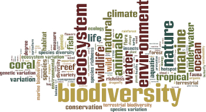
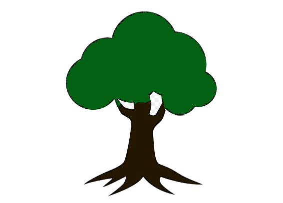
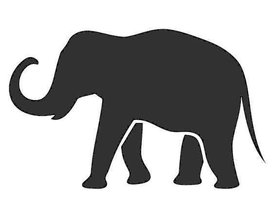
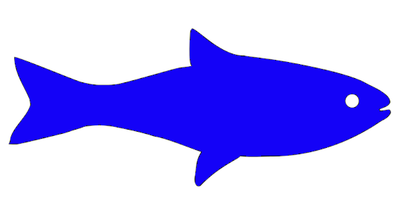
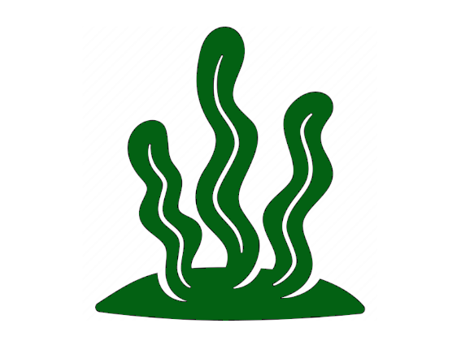
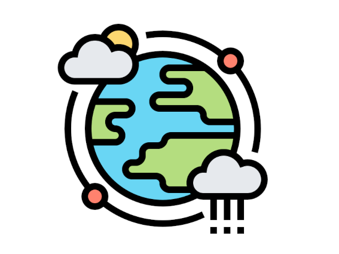
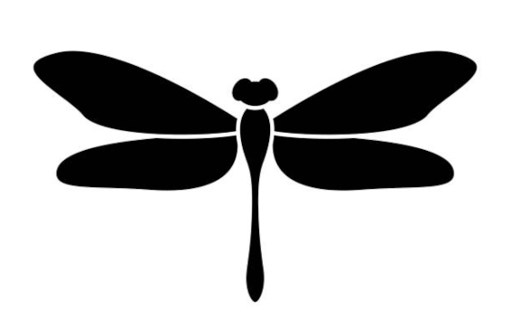
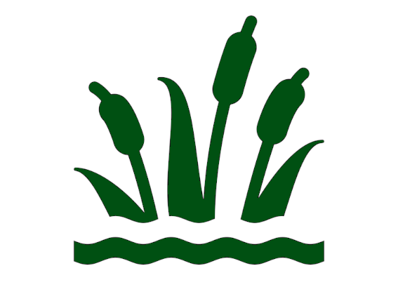
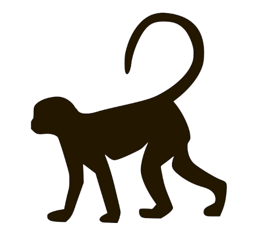
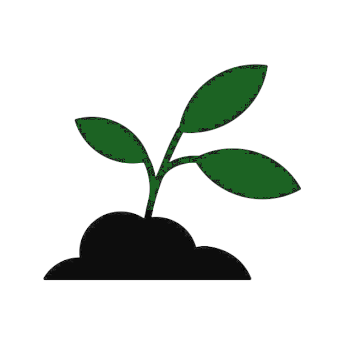

```{css, echo=FALSE}

  .logo {
    text-align: right;
    margin: -100px 0 0 0;
  }

  .logo img {
    margin: 5px;
    width: 200px;
  }
```

```{js, echo=FALSE}
$(function() {
  $('.main-container').after($('.footer'));
})
```

<br/>

<div class="logo"><a href="index.html"></a></div>

#### See key illustrative figures from major reports, papers, and resources regarding biodiversity loss.

---

<br/>

```{r echo=FALSE}
library(pixture)
```

```{r echo=FALSE}
figs <- c(
  "images/ibpes_fig_spm1.jpg" = "IPBES Global Assessment: Summary for Policymakers - Fig 1",
  "images/ibpes_fig_spm2.png" = "IPBES Global Assessment: Summary for Policymakers - Fig 2",
  "images/ibpes_fig_spm3.png" = "IPBES Global Assessment: Summary for Policymakers - Fig 3",
  "images/planetary_boundaries_2009.jpg" = "Stockholm Resilience Centre: Planetary Boundary Framework (2009)",
  "images/ipbes_ipcc_fig1_2.png" = "IPBES and IPCC Workshop Report - Fig 1.2",
  "images/ipbes_ipcc_fig1_3.png" = "IPBES and IPCC Workshop Report - Fig 1.3",
  "images/ipbes_ipcc_fig2_2.png" = "IPBES and IPCC Workshop Report - Fig 2.2",
  "images/ipbes_ipcc_fig6_5.png" = "IPBES and IPCC Workshop Report - Fig 6.5",
  "images/ipbes_ipcc_fig7_2.png" = "IPBES and IPCC Workshop Report - Fig 7.2",
  "images/ipbes_ipcc_fig7_4.png" = "IPBES and IPCC Workshop Report - Fig 7.4",
  "images/sei_nitrogen-report-summary-intro-infographic.png" = "SEI UK Nitrogen Report: Intro Infographic",
  "images/unep_makingpeace_fig2_6.png" = "UNEP: Making Peace with Nature - Fig 2.6",
  "images/unep_makingpeace_fig2_7.png" = "UNEP: Making Peace with Nature - Fig 2.7",
  "images/unep_makingpeace_fig3_1.png" = "UNEP: Making Peace with Nature - Fig 3.1",
  "images/unep_makingpeace_fig3_3.png" = "UNEP: Making Peace with Nature - Fig 3.3",
  "images/unep_makingpeace_fig3_4.png" = "UNEP: Making Peace with Nature - Fig 3.4",
  "images/unep_makingpeace_fig3_7.png" = "UNEP: Making Peace with Nature - Fig 3.7",
  "images/unep_makingpeace_fig3_9.png" = "UNEP: Making Peace with Nature - Fig 3.9",
  "images/unep_makingpeace_fig6_2.png" = "UNEP: Making Peace with Nature - Fig 6.2",
  "images/unep_makingpeace_fig6_3.png" = "UNEP: Making Peace with Nature - Fig 6.3",
  "images/unep_makingpeace_fig8_1.png" = "UNEP: Making Peace with Nature - Fig 8.1",
  "images/planetary_boundaries_2022.png" = "Stockholm Resilience Centre: Planetary Boundary Framework (2022)",
  "images/wwf_living_planet_2020_fig_indexes.png" = "WWF Living Planet (2020) - Indexes",
  "images/dasgupta_review_fig2.png" = "Dasgupta Review - Fig 2",
  "images/dasgupta_review_fig3.png" = "Dasgupta Review - Fig 3",
  "images/dasgupta_review_fig6.png" = "Dasgupta Review - Fig 6",
  "images/dasgupta_review_fig9.png" = "Dasgupta Review - Fig 9",
  "images/dasgupta_review_fig10.png" = "Dasgupta Review - Fig 10",
  "images/dasgupta_review_fig11.png" = "Dasgupta Review - Fig 11",
  "images/dasgupta_review_fig12.png" = "Dasgupta Review - Fig 12",
  "images/dasgupta_review_fig13.png" = "Dasgupta Review - Fig 13",
  "images/dasgupta_review_fig15.png" = "Dasgupta Review - Fig 15",
  "images/dasgupta_review_fig16.png" = "Dasgupta Review - Fig 16",
  "images/dasgupta_review_fig18.png" = "Dasgupta Review - Fig 18",
  "images/dasgupta_review_fig19.png" = "Dasgupta Review - Fig 19",
  "images/dasgupta_review_fig20.png" = "Dasgupta Review - Fig 20",
  "images/dasgupta_review_fig21.png" = "Dasgupta Review - Fig 21",
  "images/wwf_living_planet_2020_fig4.png"  = "WWF Living Planet (2020) - Fig 4",
  "images/wwf_living_planet_2020_fig5.png"  = "WWF Living Planet (2020) - Fig 5",
  "images/wwf_living_planet_2020_fig8.png"  = "WWF Living Planet (2020) - Fig 8",
  "images/wwf_living_planet_2020_fig10.png" = "WWF Living Planet (2020) - Fig 10",
  "images/wwf_living_planet_2020_fig12.png" = "WWF Living Planet (2020) - Fig 12",
  "images/wwf_living_planet_2020_fig13.png" = "WWF Living Planet (2020) - Fig 13",
  "images/wwf_living_planet_2020_fig15.png" = "WWF Living Planet (2020) - Fig 15",
  "images/wwf_living_planet_2020_fig17.png" = "WWF Living Planet (2020) - Fig 17",
  "images/wwf_living_planet_2020_fig20.png" = "WWF Living Planet (2020) - Fig 20",
  "images/wwf_living_planet_2020_fig22.png" = "WWF Living Planet (2020) - Fig 22",
  "images/wwf_living_planet_2020_fig23.png" = "WWF Living Planet (2020) - Fig 23",
  "images/wwf_living_planet_2020_fig24.png" = "WWF Living Planet (2020) - Fig 24",
  "images/wwf_living_planet_2020_fig25.png" = "WWF Living Planet (2020) - Fig 25",
  "images/wwf_living_planet_2020_fig26.png" = "WWF Living Planet (2020) - Fig 26",
  "images/wwf_living_planet_2020_fig27.png" = "WWF Living Planet (2020) - Fig 27",
  "images/wwf_living_planet_2020_fig28.png" = "WWF Living Planet (2020) - Fig 28",
  "images/brauman_fig1.jpg" = "Brauman - Fig 1",
  "images/brauman_fig2.jpg" = "Brauman - Fig 2",
  "images/wwf_living_planet_2022_fig1.png"  = "WWF Living Planet (2022) - Fig 1",
  "images/wwf_living_planet_2022_fig2.png"  = "WWF Living Planet (2022) - Fig 2",
  "images/wwf_living_planet_2022_fig3.png"  = "WWF Living Planet (2022) - Fig 3",
  "images/wwf_living_planet_2022_fig4.png"  = "WWF Living Planet (2022) - Fig 4",
  "images/wwf_living_planet_2022_fig5.png"  = "WWF Living Planet (2022) - Fig 5",
  "images/wwf_living_planet_2022_fig6.png"  = "WWF Living Planet (2022) - Fig 6",
  "images/wwf_living_planet_2022_fig7.png"  = "WWF Living Planet (2022) - Fig 7",
  "images/wwf_living_planet_2022_fig8.png"  = "WWF Living Planet (2022) - Fig 8",
  "images/wwf_living_planet_2022_fig10.png" = "WWF Living Planet (2022) - Fig 10",
  "images/wwf_living_planet_2022_fig11.png" = "WWF Living Planet (2022) - Fig 11",
  "images/wwf_living_planet_2022_fig12.png" = "WWF Living Planet (2022) - Fig 11",
  "images/wwf_living_planet_2022_fig13.png" = "WWF Living Planet (2022) - Fig 13",
  "images/wwf_living_planet_2022_fig14.png" = "WWF Living Planet (2022) - Fig 14",
  "images/wwf_living_planet_2022_fig15.png" = "WWF Living Planet (2022) - Fig 15",
  "images/wwf_living_planet_2022_fig16.png" = "WWF Living Planet (2022) - Fig 16",
  "images/wwf_living_planet_2022_fig17.png" = "WWF Living Planet (2022) - Fig 17",
  "images/wwf_living_planet_2022_fig18.png" = "WWF Living Planet (2022) - Fig 18",
  "images/wwf_living_planet_2022_fig19.png" = "WWF Living Planet (2022) - Fig 19",
  "images/wwf_living_planet_2022_fig21.png" = "WWF Living Planet (2022) - Fig 21",
  "images/wwf_living_planet_2022_fig23.png" = "WWF Living Planet (2022) - Fig 23",
  "images/mea_fig3.png" = "Millennium Ecosystem Assessment - Fig 3",
  "images/mea_fig4.png" = "Millennium Ecosystem Assessment - Fig 4",
  "images/mea_fig9.png" = "Millennium Ecosystem Assessment - Fig 9",
  "images/mea_fig13.png" = "Millennium Ecosystem Assessment - Fig 13",
  "images/mea_fig15.png" = "Millennium Ecosystem Assessment - Fig 15"
)

pixgallery(names(figs), caption=unname(figs))
```


<br/>
<br/>
<br/>


---

#### <a href="###" data-toggle="collapse" data-target="#sources_block">Sources</a> 

<div id="sources_block" class="collapse"> 

<br/>


- #### Brauman, K. A., et. al. (2020). Global trends in nature’s contributions to people. In Proceedings of the National Academy of Sciences (Vol. 117, Issue 51, pp. 32799–32805). Proceedings of the National Academy of Sciences. https://doi.org/10.1073/pnas.2010473117

- #### Dasgupta, P. (2021), The Economics of Biodiversity: The Dasgupta Review. Abridged Version. (London: HM Treasury).

- #### Hicks, K. & McKendree, J., 2022. A comprehensive approach to nitrogen in the UK, SEI: Stockholm Environment Institute. Sweden. Retrieved from https://policycommons.net/artifacts/2243018/a-comprehensive-approach-to-nitrogen-in-the-uk/3001185/ on 04 Nov 2022. CID: 20.500.12592/p9574g.

- #### IPBES (2019): Summary for policymakers of the global assessment report on biodiversity and ecosystem services of the Intergovernmental Science-Policy Platform on Biodiversity and Ecosystem Services. S. Díaz, J. Settele, E. S. Brondízio, H. T. Ngo, M. Guèze, J. Agard, A. Arneth, P. Balvanera, K. A. Brauman, S. H. M. Butchart, K. M. A. Chan, L. A. Garibaldi, K. Ichii, J. Liu, S. M. Subramanian, G. F. Midgley, P. Miloslavich, Z. Molnár, D. Obura, A. Pfaff, S. Polasky, A. Purvis, J. Razzaque, B. Reyers, R. Roy Chowdhury, Y. J. Shin, I. J. Visseren-Hamakers, K. J. Willis, and C. N. Zayas (eds.). IPBES secretariat, Bonn, Germany. 56 pages. https://doi.org/10.5281/zenodo.3553579 

- #### J. Lokrantz/Azote based on Steffen, W. et al. (2015) 'Planetary boundaries: Guiding human development on a changing planet', Science, 347(6223:1–10).

- #### Millennium Ecosystem Assessment, 2005. Ecosystems and Human Well-being: Synthesis. Island Press, Washington, DC.

- #### Pörtner, H.O., Scholes, R.J., Agard, J., Archer, E., Arneth, A., Bai, X., Barnes, D., Burrows, M., Chan, L., Cheung, W.L., Diamond, S., Donatti, C., Duarte, C., Eisenhauer, N., Foden, W., Gasalla, M. A., Handa, C., Hickler, T., Hoegh-Guldberg, O., Ichii, K., Jacob, U., Insarov, G., Kiessling, W., Leadley, P., Leemans, R., Levin, L., Lim, M., Maharaj, S., Managi, S., Marquet, P. A., McElwee, P., Midgley, G., Oberdorff, T., Obura, D., Osman, E., Pandit, R., Pascual, U., Pires, A. P. F., Popp, A., Reyes-García, V., Sankaran, M., Settele, J., Shin, Y. J., Sintayehu, D. W., Smith, P., Steiner, N., Strassburg, B., Sukumar, R., Trisos, C., Val, A.L., Wu, J., Aldrian, E., Parmesan, C., Pichs-Madruga, R., Roberts, D.C., Rogers, A.D., Díaz, S., Fischer, M., Hashimoto, S., Lavorel, S., Wu, N., Ngo, H.T. 2021. IPBES-IPCC co-sponsored workshop report on biodiversity and climate change; IPBES and IPCC, DOI:10.5281/zenodo.4782538 

- #### United Nations Environment Programme (2021). Making Peace with Nature: A scientific blueprint to tackle the climate, biodiversity and pollution emergencies. Nairobi. https://www.unep.org/resources/making-peace-nature

- #### WWF (2020) Living Planet Report 2020 - Bending the curve of biodiversity loss. Almond, R.E.A., Grooten M. and Petersen, T. (Eds). WWF, Gland, Switzerland.

- #### WWF (2022) Living Planet Report 2022 - Building a nature-positive society. Almond, R.E.A., Grooten, M., Juffe Bignoli, D. & Petersen, T. (Eds). WWF, Gland, Switzerland.

</div>

---

#### Why _And Biodiversity_? To learn of the human impact:

<br/>

<div class="table_container">
<table id="bottom_icons">
   <tr>
      <td><span data-text="75% of terrestrial environment “severely altered” to date by human actions (IPBES GA)" tabindex="0"></span></td>
      <td><h3>Terrestrial<br/>Environments</h3></td>
      <td><span data-text="At least 680 vertebrate species were driven to extinction by human actions since the 16th century (IPBES GA)" tabindex="0"></span></td>
      <td><h3>Wild Verterbrate<br/>Species</h3></td>
      <td><span data-text="66% of marine environment “severely altered” to date by human actions (IPBES GA)" tabindex="0"></span></td>
      <td><h3>Marine<br/>Environments</h3></td>
      <td><span data-text="Approximately half the live coral cover on coral reefs has been lost since the 1870s, with accelerating losses in recent decades due to climate change exacerbating other drivers (IPBES GA)" tabindex="0"></span></td>
      <td><h3>Coral Reef<br/>Decline</h3></td>
      <td><span data-text="Humans are estimated to have caused an observed warming of approximately 1.0°C by 2017 relative to pre-industrial levels, with average temperatures over the past 30 years rising by 0.2°C per decade. (IPBES GA)" tabindex="0"></span></td>
      <td><h3>Global<br/>Warming</h3></td>
   </tr>
   <tr>
      <td><span data-text="Insect abundance has declined very rapidly in some places even without large-scale land-use change, but the global extent of such declines is not known (IPBES GA)" tabindex="0"></span></td>
      <td><h3>Insect<br/>Abundance</h3></td>
      <td><span data-text="Cumulative records of alien species have increased by 40 per cent since 1980, associated with increased trade and human population dynamics and trends. (IPBES GA)" tabindex="0"></span></td>
      <td><h3>Increased<br/>Trade</h3></td>
      <td><span data-text="Humans have been enjoying such benefits for millennia for agriculture, aquaculture, and urban development, among other activities, which often led to widespread wetland degradation (IPBES-IPCC)" tabindex="0"></span></td> 
      <td><h3>Wetland<br/>Degradation</h3></td>
      <td><span data-text="The global biomass of wild mammals has fallen by 82 per cent since prehistory (IPBES GA)" tabindex="0"></span></td>
      <td><h3>Global<br/>Biomass</h3></td>
      <td><span data-text="Over 33% of world’s land surface (and +/-75% of freshwater resources) devoted to crop or livestock production (IPBES GA)" tabindex="0"></span></td>
      <td><h3>Agriculture</h3></td>
   </tr>
</table>
</div>


::: {.footer}
<div class="footer_box">
  <div class="footer_column" id="footer_label">
  <a href="index.html"></a>
  <a href="index.html"> | And Biodiversity</a>
  </div>
  <div class="footer_column">
A Rock, A River, A Tree<br/>
Hosts to species long since departed,<br/>
Marked the mastodon,<br/>
The dinosaur, who left dried tokens
  </div>
  <div class="footer_column">
Of their sojourn here<br/>
On our planet floor,<br/>
Any broad alarm of their hastening doom<br/>
Is lost in the gloom of dust and ages...
  </div>
  <div class="footer_column"> 
-"On the Pulse of Morning" <br/>
  Maya Angelou<br/>
  </div>
</div>
:::
