```{js, echo=FALSE}
$(function() {
  $('.main-container').after($('.footer'));
})
```

```{r, echo=FALSE}
library(metathis)

meta(
) |> meta_general(
  description = "Online information resource to study the other planetary crisis, biodiversity loss, with overview, reports, figures, quotes, and resources."
)
```

<div class="logo"></div>

#### From the opening of their joint workshop report, selected IPBES and IPCC experts, stated<br/>(emphasis added):

> #### Climate change ***and biodiversity loss*** are two of the most pressing issues of the Anthropocene.

<div class="scibody" id="bottom_icons">
<span data-text="IPBES is an intergovernmental science-policy body to assess biodiversity and ecosystem services" tabindex="0">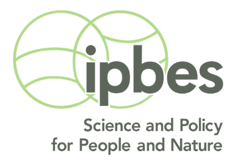</span>
<span data-text="IPCC is an intergovernmental science-policy body to assess climate change" tabindex="0">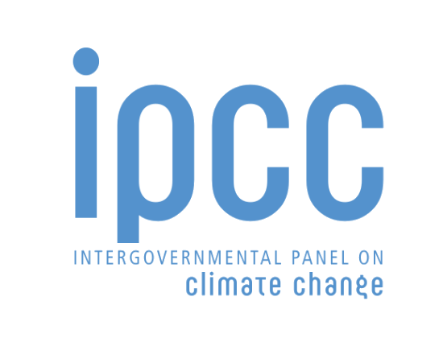</span>
</div>

#### This open source information site, _And Biodiversity_, aims to serve as a resource to study the latter crisis which often runs silent, invisible, and in the background to the general public. 

#### For any explanation, citation, or justification regarding ***biodiversity loss***, bookmark this site and return to review the topic, major reports, figures, quotes, and resources.

<br/>

<div class="cards">
<div class="card">
  <a href="overview.html">
  <div class="cardheader">
  <p>OVERVIEW</p>
  </div>
  <div class="cardbody">
  <p>Learn the what, who, when, where, why, and how about <b><i>biodiversity loss</i></b></p>
  
  </div>
  </a>
</div>
<div class="card">
  <a href="reports.html">
  <div class="cardheader">
  <p>REPORTS</p>
  </div>
  <div class="cardbody">
  <p>Review past and present global reports on <b><i>biodiversity loss</i></b></p>
  
  </div>
  </a>
</div>
<div class="card">
  <a href="figures.html">
  <div class="cardheader">
  <p>FIGURES</p>
  </div>
  <div class="cardbody">
  <p>Visually study report graphics to learn the extent of <b><i>biodiversity loss</i></b></p>
  
  </div>
  </a>
</div>
<div class="card">
  <a href="quotes.html">
  <div class="cardheader">
  <p>QUOTES</p>
  </div>
  <div class="cardbody">
  <p>Find, read, and cite line snippets from major reports about <b><i>biodiversity loss</i></b></p>
  
  </div>
  </a>
</div>
<div class="card">
  <a href="resources.html">
  <div class="cardheader">
  <p>RESOURCES</p>
  </div>
  <div class="cardbody">
  <p>Dive into news, data, research, and initiatives related to <b><i>biodiversity loss</i></b></p>
  
  </div>
  </a>
</div>
</div>


---

#### Why _And Biodiversity_? To mainstream the issue across domains:

<br/>

<div class="stick_image"></div>

#### **Media**

> #### "We continue to provide the latest on our series on Climate Change ***and Biodiversity Loss***."

<br/>

<div class="stick_image"></div>

#### **Politics**

> #### "Climate change ***and biodiversity loss*** are existential threats and are on the ballot this election."

<br/>

<div class="stick_image"></div>

#### **Business**

> #### "We forecast in next quarter into next few fiscal years losses due to climate change ***and biodiversity loss***."

<br/>

<div class="stick_image"></div>

#### **Education**

> #### "Class, we will continue our lesson on issues very important to the Earth: climate change ***and biodiversity loss***."

<br/>

<div class="stick_image"></div>

#### **Activism**

> #### "Save our planet from the Climate Crisis ***and Biodiversity Crisis!***"

<br/>

<div class="stick_image"></div>

#### **Civil Society**

> #### "You know I'm really starting to worry about climate change ***and biodiversity loss***."

<br/>

---

<br/>


#### Why _And Biodiversity_? To raise awareness of nature-based solutions:

<br/>


<div class="climate_image">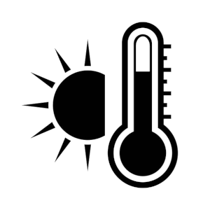</div>

#### **Heatwaves**

> #### Climate change causes prolonged and intense heatwaves, ***and biodiversity*** with transpiration of trees and plants can bring a coolness and reduce urban heat island effects.

<br/>


<div class="climate_image">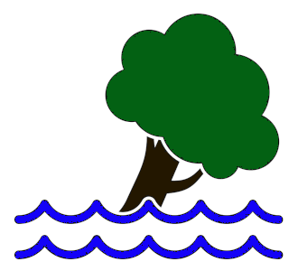</div>

#### **Flooding**

> #### Climate change causes more extreme weather events, ***and biodiversity*** with healthy rivers, wetlands, and coral reefs across coastlines and floodplains can absorb and buffer storm surges and flooding.

<br/>

<div class="climate_image"></div>

#### **Famine**

> #### Climate change causes more crop yields to decline, ***and biodiversity*** with rich soil organisms can regulate and regenerate soil health and with diverse crops and livestock can stabilize food supply. 

<br/>


<div class="climate_image">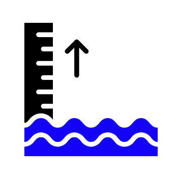</div>

#### **Drought**

> #### Climate change causes more widespread droughts, ***and biodiversity*** with healthy freshwater ecosystems can regulate water quality, flow, supply, and enhance groundwater systems.

<br/>

<div class="climate_image"></div>

#### **Pests**

> ####  Climate change causes spread of forest and crop pests and diseases, ***and biodiversity*** with native and diverse species in place of non-native, monocultured plantations can decrease prevalence of pests and diseases.

<br/>

<div class="climate_image"></div>

#### **Wildfires**

> ####  Climate change causes more extreme wildfires, ***and biodiversity*** with diverse forests in genes and species can spread risk, increase resistance to stresses, and promote resilience to forest systems.

<br/>

<div class="climate_image">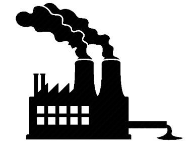</div>

#### **Emissions**

> ####  Climate change mostly derives from emitting carbon emissions into atmosphere, ***and biodiversity*** with healthy forests, wetlands, mangroves, seagrass, and other biomes can naturally capture and sequester carbon. 

<br/>

---

<br/>


#### Why _And Biodiversity_? To underscore its importance:

<br/>


<div class="climate_image"></div>

#### **Economy**

> #### Modern economies often measure the accumulation of produced capital (roads, machines, buildings, factories, and ports) and human capital (health and education) but overlook the essential natural capital ***and biodiversity*** provides such value from raw materials to regulation of resources and environment (air, food, water, climate) to support commerce and livelihoods.

<br/>

<div class="climate_image"></div>

#### **Society**

> #### A society free from conflict, inequality, and uncertainty requires a stable climate and healthy ecosystems for basic amenities, occupations, and recreation,  ***and biodiversity*** supports such requirements through functioning carbon, nitrogen, and water cycles and habitat maintenance.

<br/>


<div class="climate_image"></div>

#### **Culture**

> #### Since dawn of human civilization, species and ecosystems have been integral in culture including languages, arts, foods, customs, beliefs, and values ***and biodiversity*** (akin to human diversity) serves as this living library and heritage.

<br/>

<div class="climate_image"></div>

#### **Health**

> ####  Physical, mental, and social health and well-being require a stable climate and healthy ecosystems ***and biodiversity*** serves these needs with air, water, and food quality; medicinal supply; hazard and disease protection; recreation and inspiration.

<br/>

<div class="climate_image"></div>

#### **Infrastructure**

> ####  Robust critical infrastructure of water, energy, food, and commodity supply requires vital inputs ***and biodiversity*** provides water flow and quantity; food pollination and seed dispersal; and natural resources such as fiber, fuel, and timber.

<br/>

<div class="climate_image"></div>

#### **Survival**

> ####  Essential human survival needs of air, water, food, and shelter requires a stable cimate and healthy ecosystems ***and biodiversity*** provides such habital existence for humans and many other species.

<br/>

---

#### Why _And Biodiversity_? To dispel common misunderstandings:

<br/>

<div class="accordion-wrapper" id="learnmore">
<div class="accordion">
  <input type="radio" name="radio-a" id="check1">
  <label class="accordion-label" for="check1">Biodiversity loss is not as immediate an issue as climate change.</label>
  <div class="accordion-content">
  <p>Although the media and general public overlook biodiversity loss for various reasons, scientists have consistently asserted the devastating consequences of continued loss of biodiversity which is accelerating at unprecedented levels in human history.</p></br>
  <p>Such loss negatively impacts ecosystem services such as life-critical needs of food production, soil formation, water availability, air quality, climate regulation, medicines, and still others. _See_ [**Reports**](reports.html) for discussion of this crisis over the last 50 years.</p>
  <div class="banner">
  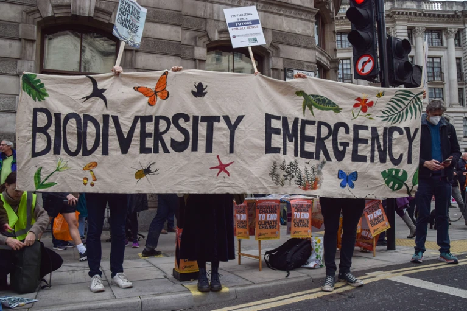
  <p>Source: [Nature.com article](https://www.nature.com/articles/d41586-021-03781-z){target="_blank"}</p>
  </div>
  </div>
</div>
<div class="accordion">
  <input type="radio" name="radio-a" id="check2">
  <label class="accordion-label" for="check2">Climate change encompasses biodiversity loss and other environment issues.</label>
  <div class="accordion-content">
  <p>Owing to its popularity over the years, climate change has become synonymous with all environment or green issues and therefore encompasses all ecological crises. In reality, climate change is only one issue under the umbrella of nature crises.</p></br>
  <p>In fact, climate is just one of several planetary boundaries of the Earth System which includes biodiversity, ozone, freshwater, land use, nitrogen and phosophorus cycle, chemicals, and others. _See_ [**Figures**](figures.html) for other diagrams of planetary boundaries.</p>
  <div class="banner">
  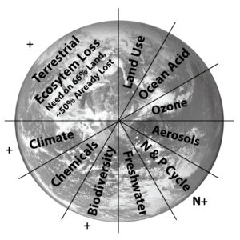
  <p>Source: [MAHB post](https://mahb.stanford.edu/blog/end-being-boundaries/){target="_blank"}</p>
  </div>
  </div>
</div>
<div class="accordion">
  <input type="radio" name="radio-a" id="check3">
  <label class="accordion-label" for="check3">Biodiversity loss sounds like a new topic and not as widely accepted.</label>
  <div class="accordion-content">
  <p>Though the issue lacks mainstream media attention, biodiversity loss has been an enduring subject matter in the ecological and environment science literature since the 1970s. It is widely accepted in science with enough impetus to establish a UN convention in 1992 for global initiatives on the issue and intergovernmental science body in 2012 to assess the current knowledge on the topic for policymakers.</p></br>
  <p>_See_ [**Reports**](reports.html) that includes three global assessments across the decades (1995, 2005, and 2019) each with stark findings of rapid biodiversity loss due to human activities.</p>
  <div class="banner">
  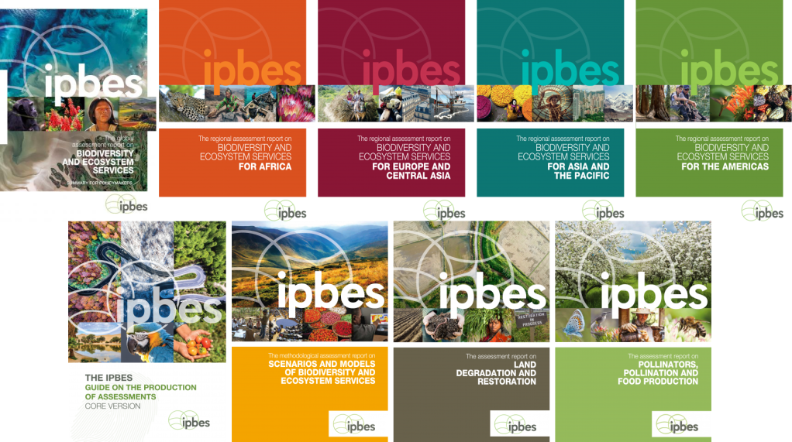
  </div>
  </div>
</div>
<div class="accordion">
  <input type="radio" name="radio-a" id="check4">
  <label class="accordion-label" for="check4">Climate change causes biodiversity loss, so are the same thing.</label>
  <div class="accordion-content">
  <p>While the two crises share mutually reinforcing and overlapping causes and effects, the scientific evidence over decades demonstrates both crises are distinct issues and should not be conflated without acknowledgment of their unique and shared qualities.</p></br>
  <p>Consequently, the approach to solve one may negatively or positively affect the other. _See_ [**Figures**](figures.html) that show graphics of overlap, trade-offs, and synergies between the two planetary emergencies.</p>
  <div class="banner">
  
  </div>
  </div>
</div>
<div class="accordion">
  <input type="radio" name="radio-a" id="check5">
  <label class="accordion-label" for="check5">Biodiversity loss is a natural phenomenon.</label>
  <div class="accordion-content">
  <p>While species extinctions and ecosystem shifts are natural processes on Earth including five known mass extinction events, the present situation of biodiversity loss exceeds the natural occurrence in geological timescales. Also, unlike past events, the current rapid loss of biodiversity and ecosystems is mostly due to a single species aware of their actions.</p></br>
  <p>_See_ [**Quotes**](quotes.html) which includes the finding from IPBES's 2019 Global Assessment: the rate of extinction is ten to hundreds of times higher than the average background rate in the last 10 million years and is accelerating.</p>
  <div class="banner">
  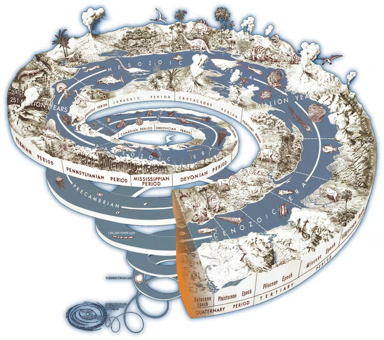
  <p>Source: [TheConversation.com article](https://theconversation.com/an-official-welcome-to-the-anthropocene-epoch-but-who-gets-to-decide-its-here-57113){target="_blank"}</p>
  </div>
  </div>
</div>
<div class="accordion">
  <input type="radio" name="radio-a" id="check6">
  <label class="accordion-label" for="check6">Biodiversity loss would not be hardly known if it is so important.</label>
  <div class="accordion-content">
  <p>Biodiversity coverage in the media has been a challenge for decades and in turn causes a lack of awareness among the general public. Studies ([IIED (2008)](https://www.jstor.org/stable/resrep01416#metadata_info_tab_contents){target="_blank"} and [Legagneux, et al. (2018)](https://www.frontiersin.org/articles/10.3389/fevo.2017.00175/full){target="_blank"}) have discussed the under-reported media coverage of biodiversity loss compared to climate change. As an unfortunate result, only experts tend to know about this planetary crisis.</p></br>
  <p>Even Sir Robert Watson, who either chaired or co-chaired all three global biodiversity assessments acknowledge in a [Guardian op-ed](https://www.theguardian.com/environment/2019/sep/19/biodiversity-touches-every-aspect-of-our-lives-so-why-has-its-loss-been-ignored){target="_blank"} how much biodiversity has been ignored despite its severity and critical importance.</p>
  <div class="banner">
  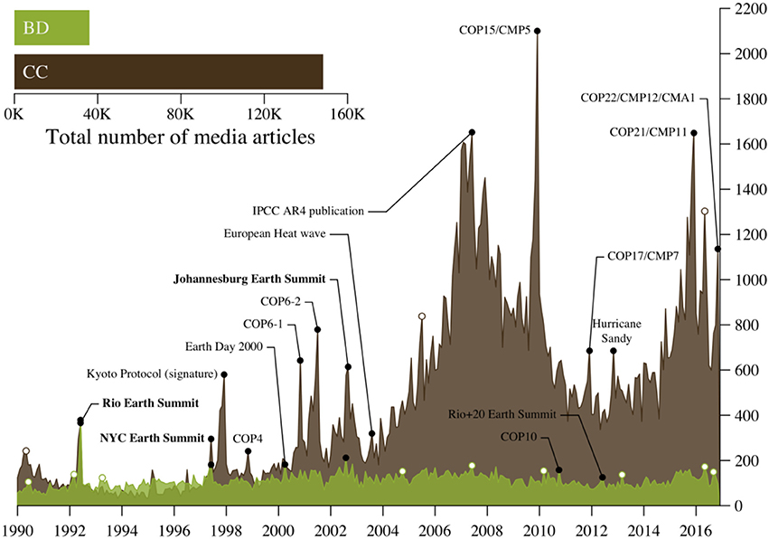
  <p>Source: [Frontiers paper](https://www.frontiersin.org/articles/10.3389/fevo.2017.00175/full){target="_blank"}</p>
  </div>
  </div>
</div>
</div>

<br/>

---

#### Why _And Biodiversity_? To help stop:

<br/>

<div class="table_container">
  <table id="bottom_icons">
   <tr>
      <td><span data-text="Global forest area is now approximately 68% of the estimated pre-industrial level (IPBES GA)" tabindex="0"></span></td>
      <td><h3>Logging</h3></td>
      <td><span data-text="African elephants have declined by 30-fold over the last century (from 12 million to ~400,000) with more than 100,000 elephants killed by poachers between 2010 and 2012 (IPBES 2020)" tabindex="0"></span></td>
      <td><h3>Poaching</h3></td>
      <td><span data-text="33% of marine fish stocks in 2015 have been harvested at unsustainable levels; 60% are maximally sustainably fished; 7% are underfished (IPBES GA)" tabindex="0"></span></td>
      <td><h3>Overfishing</h3></td>
      <td><span data-text="The extent of seagrass meadows have decreased over 10% per decade from 1970-2000 (IPBES GA)" tabindex="0"></span></td>
      <td><h3>Dredging</h3></td>
      <td><span data-text="Since 1980 greenhouse gas emissions have increased 100%, raising average global temperature by at least 0.7 degree (IPBES GA)" tabindex="0"></span></td>
      <td><h3>Emitting</h3></td>
   </tr>
   <tr>
      <td><span data-text="Tentative estimate of +/-10% of insect species are threatened with extinction (IPBES GA)" tabindex="0"></span></td>
      <td><h3>Spraying</h3></td>
      <td><span data-text="300-400 million tons of heavy metals, solvents, toxic sludge and other wastes from industrial facilities are dumped annually into the world’s waters (IPBES GA)" tabindex="0"></span></td>
      <td><h3>Dumping</h3></td>
      <td><span data-text="85% of wetlands present in 1700 had been lost by 2000 where loss of wetlands is currently three times faster, in percentage terms, than forest loss (IPBES GA)" tabindex="0"></span></td>
      <td><h3>Draining</h3></td>
      <td><span data-text="Average abundance of native species in most major land-based habitats has fallen by at least 20%, mostly since 1900 (IPBES GA)" tabindex="0"></span></td>
      <td><h3>Encroaching</h3></td>
      <td><span data-text="Land degradation has reduced productivity in 23 per cent of the global terrestrial area (IPBES GA)" tabindex="0"/></span></td>
      <td><h3>Degrading</h3></td>
   </tr>
  </table>
</div>


::: {.footer}
<div class="footer_box">
  <div class="footer_column" id="footer_label">
  <a href="index.html"></a>
  <a href="index.html"> | And Biodiversity</a>
  </div>
  <div class="footer_column">
...Hence, these shades <br/>
Are still the abodes of gladness; the thick roof <br/>
Of green and stirring branches is alive <br/>
And musical with birds, that sing and sport <br/>
In wantonness of spirit; while below
  </div>
  <div class="footer_column">
The squirrel, with raised paws and form erect, <br/>
Chirps merrily. Throngs of insects in the shade <br/>
Try their thin wings and dance in the warm beam <br/>
That waked them into life. Even the green trees <br/>
Partake the deep contentment...<br/>
  </div>
  <div class="footer_column"> 
-"Inscription for the Entrance to a Wood" <br/>
William Cullen Bryant<br/>
   </div>
</div>
:::

