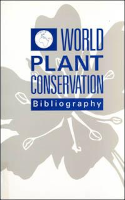

```{css, echo=FALSE}
  .main-container {
    max-width: 1200px;
    margin-left: auto;
    margin-right: auto;
  }

  @media (max-width:1200px) and (min-width:760px) {
    #navbar > ul > li > a {
       font-size: 0;
       display:inline-block;
    }
    .fa { font-size: initial; }
  }
  
  .nav-pills {
     font-size: 14px;
  }

  .logo {
    text-align: right;
    margin: -100px 0 0 0;
  }

  .logo img {
    margin: 5px;
    width: 200px;
  }
  
  .reports_banner {
     text-align: center;
  }
  .reports_banner img {
     width: 800px;
  }
  
  .collapse {
     overflow: hidden;
  }
  .collapse img {
     padding: 10px;
     float: left;
  }
  
  .table_container {
     overflow-x: auto;
     width: 100%;
     margin: 0 auto;
  }
  
  #bottom_icons {
     margin: 0 auto;
  }
  
  #bottom_icons img {
     padding: 10px;
     width: 100px;
  }
  
  #bottom_icons h3 {
     text-align: center;
     font-size: 18px;
  }
  
  .footer {
     bottom: 0;
     width: 100%;
     height: 140px;
     margin: 0px auto -40px auto;
     color: #ffffff;
     background-color: #808080;
     border-color: #93c54b;
     overflow-y: auto;
  }
  
  .footer_box {
     width: 70%;
     margin: 0 auto;
  }
  
  .footer_label {
     padding: 5px;
     font-size: 16px;
     width: 80%;
  }
  .footer_label a, 
  .footer_label a:hover, 
  .footer_label a:focus, 
  .footer_label a:active {
     color: #ffffff;
  }
  
  .footer_space {
     font-size: 14px;
     float: left;
     width: 15%;
  }
  .footer_column {
     font: normal italic 14px Arial;
     float: left;
     width: 25%;
  }
  @media screen and (max-width: 750px) {
      .footer {
         height: auto;
         min-height: 100% !important;
      }
      .footer_column {
          width: 70%;
          padding: 0 20px 20px 20px;
      }
      .footer_space {
          width: 70%;
          padding: 0 20px;
      }
      
      #bottom_icons tr {
          display: block;
          margin-bottom: .625em;
      }
      #bottom_icons td {
          display: block;
          font-size: .8em;
          text-align: right;
      }
      #bottom_icons h3 {
          font-size: 2vh;
      }
      #bottom_icons img {
          width: 150px;
      }
      #bottom_icons td::before {
          float: left;
          font-weight: bold;
          text-transform: uppercase;
      }
  }
```

```{js, echo=FALSE}
$(function() {
  $('.main-container').after($('.footer'));
})
```

<br/>

<div class="logo"></div>

#### Review key findings and links to major global reports over the last 50+ years regarding biodiversity loss and natural environment.

<br/>

<div class="reports_banner"></div>

<br/>
<br/>


# {.tabset .tabset-fade .tabset-pills}

## 2020-2022

### 2022


- #### <a href="###" data-toggle="collapse" data-target="#unep2022">UNEP: State of Finance for Nature 2022</a> 

  <div id="unep2022" class="collapse">  

  <a href="https://www.unep.org/resources/report/state-finance-nature-2022" target="_blank">
    
  </a>

  #### With sufficient finance, nature-based solutions (NbS) provide the means to cost-effectively reach climate, ***biodiversity*** and land degradation neutrality targets, particularly if investments simultaneously contribute to ***biodiversity*** (National Biodiversity Strategies and Action Plans [NBSAPs]), climate (Nationally determined contributions [NDC]) and restoration (Land Degradation Neutrality [LDN]) targets. This “double” or “triple” win potential is particularly alluring given the current economic situation...Delayed action is no longer an option in the face of the devastating effects of climate change, the extinction crisis and severe land degradation globally. Politicians, business and finance leaders and citizens globally must transform their relationship with nature to work with it rather than against it...Private sector investment in NbS must increase by several orders of magnitude in the coming years...Nature-negative expenditures far outweigh investments in nature-based solutions...increase direct finance flows to NbS through public domestic expenditure, nature-focused Official Development Assistance (ODA), ensuring that multilateral development banks (MDBs) and development finance institutions (DFIs) prioritise green finance, and providing regulation and incentives for private sector investment, particularly in nature markets and sustainable supply chains. [***See* report.**](https://www.unep.org/resources/report/state-finance-nature-2022){target="_blank"}

  <br/>
  
  </div>
  
- #### <a href="####" data-toggle="collapse" data-target="#wwf2022">World Wildlife Fund: Living Planet Report</a> 

  <div id="wwf2022" class="collapse">  
  
  <a href="https://livingplanet.panda.org/en-us/" target="_blank">
     
  </a>
  
  #### Today we face the double, interlinked emergencies of human-induced climate change and the ***loss of biodiversity***, threatening the well-being of current and future generations. As our future is critically dependent on ***biodiversity*** and a stable climate, it is essential that we understand how nature’s decline and climate change are connected. [***See* report**](https://livingplanet.panda.org/en-us/){target="_blank"}

  <br/>
  
  </div>
  
- #### <a href="####" data-toggle="collapse" data-target="#bli2022">BLI: State of the World’s Birds 2022</a> 

  <div id="bli2022" class="collapse">  
  
  <a href="https://www.birdlife.org/papers-reports/state-of-the-worlds-birds-2022/" target="_blank">
     
  </a>
  
  #### Being widely distributed, relatively easy to survey, and responsive to environmental change, birds are useful ***biodiversity*** indicators, revealing wider trends in natural ecosystems...One in eight bird species is threatened with extinction, and the status of the world’s birds continues to deteriorate: species are moving ever faster towards extinction. For those not yet considered threatened, the majority are in decline and have much-depleted populations. [***See* report**](https://www.birdlife.org/papers-reports/state-of-the-worlds-birds-2022/){target="_blank"}.

  <br/>
  
  </div>
  
- #### <a href="####" data-toggle="collapse" data-target="#unccd2022">UNCCD: Global Land Outlook 2</a> 

  <div id="unccd2022" class="collapse">  

  <a href="https://unccd.int/resources/global-land-outlook/glo2" target="_blank">
    
  </a>
  
  #### Land resources – soil, water, and ***biodiversity*** – provide the foundation for the wealth of our societies and economies. They meet the growing needs and desires for food, water, fuel, and other raw materials that shape our livelihoods and lifestyles. However, the way we currently manage and use these natural resources is threatening the health and continued survival of many species on Earth, including our own. [***See* report**](https://unccd.int/resources/global-land-outlook/glo2){target="_blank"}.

  <br/>
  
  </div>
  
- #### <a href="####" data-toggle="collapse" data-target="#ipbesvalues2022">IPBES: Assessment Report on Diverse Values and Valuation of Nature</a> 

  <div id="ipbesvalues2022" class="collapse">  
  
  <a href="https://ipbes.net/media_release/Values_Assessment_Published" target="_blank">
     
  </a>
  
  #### The way nature is valued in political and economic decisions is both a key driver of the global ***biodiversity crisis*** and a vital opportunity to address it...Economic and political decisions have predominantly prioritised certain values of nature, particularly market-based instrumental values of nature, such as those associated with food produced intensively. Although often privileged in policymaking, these market values do not adequately reflect how changes in nature affect people’s quality of life. Furthermore, policymaking overlooks the many non-market values associated with nature’s contributions to people, such as climate regulation and cultural identity. [***See* report**](https://ipbes.net/media_release/Values_Assessment_Published){target="_blank"}.

  <br/>
  
  </div>

- #### <a href="####" data-toggle="collapse" data-target="#faofish2022">FAO: The State of World Fisheries and Aquaculture (SOFIA) 2022</a> 

  <div id="faofish2022" class="collapse">  
  
  <a href="https://www.fao.org/publications/sofia/2022/en/" target="_blank">
     
  </a>
  
  #### Fishery resources continue to decline due to overfishing, pollution, poor management and other factors, but the number of landings from biologically sustainable stocks is on the rise...Effective fisheries management has been proven to successfully rebuild stocks and increase catches within ecosystem boundaries. Improving global fisheries management remains crucial to restore ecosystems to a healthy and productive state and protect the long-term supply of aquatic foods...Aquatic animal production is forecast to grow another 14 percent by 2030. It is vital this growth goes hand in hand with safeguarding ecosystems, reducing pollution, protecting ***biodiversity*** and ensuring social equity [***See* report**](https://www.fao.org/publications/sofia/2022/en/){target="_blank"}.

  <br/>
  
  </div>
  
- #### <a href="####" data-toggle="collapse" data-target="#ipbeswild2022">IPBES: Assessment Report on the Sustainable Use of Wild Species</a> 

  <div id="ipbeswild2022" class="collapse">  
  
  <a href="https://ipbes.net/sustainable-use-assessment" target="_blank">
    
  </a>
  
  #### The use of wild species is widespread and occurs across almost all aquatic and terrestrial ecosystems, in subsistence to global economies, and is embedded in local and global systems, including for food, medicine, hygiene, energy and many other uses. Addressing the causes of unsustainable use and promoting and ensuring the sustainable use of wild species are critical for people and to address ***biodiversity decline***. [***See* report**](https://ipbes.net/sustainable-use-assessment){target="_blank"}.

  <br/>
  
  </div>
  
- #### <a href="####" data-toggle="collapse" data-target="#faoforests2022">FAO: The State of the World's Forests (SOFO) 2022</a> 

  <div id="faoforests2022" class="collapse">  
  
  <a href="https://www.fao.org/publications/sofo/2022/en/" target="_blank">
     
  </a>
  
  #### Environmental deterioration is contributing to climate change, ***biodiversity loss*** and the emergence of new diseases. Forests and trees can play crucial roles in addressing these crises and moving towards sustainable economies. Three interrelated pathways involving forests and trees can support economic and environmental recovery. These are (1) halting deforestation and maintaining forests; (2) restoring degraded lands and expanding agroforestry; and (3) sustainably using forests and building green value chains. [***See* report**](https://www.fao.org/publications/sofo/2022/en/){target="_blank"}.

  <br/>
  
  </div>
  
- #### <a href="####" data-toggle="collapse" data-target="#ipcc6ar2">IPCC: Sixth Assessment Part 2: Climate Change - Impacts, Adaptation and Vulnerability</a> 

  <div id="ipcc6ar2" class="collapse">  
  
  <a href="https://www.ipcc.ch/report/sixth-assessment-report-working-group-ii/" target="_blank">
    
  </a>
  
  #### This report recognizes the interdependence of climate, ***ecosystems and biodiversity***, and human societies (Figure SPM.1) and integrates knowledge more strongly across the natural, ecological, social and economic sciences than earlier IPCC assessments. The assessment of climate change impacts and risks as well as adaptation is set against concurrently unfolding non-climatic global trends e.g., ***biodiversity loss***, overall unsustainable consumption of natural resources, land and ecosystem degradation, rapid urbanisation, human demographic shifts, social and economic inequalities and a pandemic [***See* report**](https://www.ipcc.ch/report/sixth-assessment-report-working-group-ii/){target="_blank"}.

  <br/>
  
  </div>

- #### <a href="####" data-toggle="collapse" data-target="#sei2022">Stockholm Environment Institute: A Comprehensive Approach to Nitrogen in the UK</a> 

  <div id="sei2022" class="collapse">  
  
  <a href="https://www.sei.org/publications/nitrogen-in-uk-wwf/" target="_blank">
    
  </a>
  
  #### Since the 1960s, human use of synthetic Nr fertilizers has increased 9-fold globally and a further substantial increase of around 40-50% is expected over the next 40 years based on current trends. Together with increased fossil fuel combustion, humans have now created excess Nr pollution that spans all environmental compartments with multiple threats, to the extent that the disruption of the natural nitrogen cycle is now one of the greatest global threats to the environment of the 21st century. Key N threats include: reductions in ***biodiversity***  (i.e. degradation of sensitive habitats); accelerated climate change via the production of nitrous oxide gas (N2O); widespread air pollution leading to growing incidences of upper respiratory disease and cancer in humans; depletion of stratospheric ozone layer via the production of nitrous oxide gas (N2O); eutrophication of aquatic ecosystems and hypoxic “dead zones” in the coastal ocean; and acidification of soils and forests of natural ecosystems. [***See* report**](https://www.sei.org/publications/nitrogen-in-uk-wwf/){target="_blank"}.

  <br/>
  
  </div>
  

<br/>
<br/>

### 2021

- #### <a href="####" data-toggle="collapse" data-target="#unepplastic2021">UNEP: From Pollution to Solution: A global assessment of marine litter and plastic pollution</a> 

  <div id="unepplastic2021" class="collapse">  

  <a href="https://www.unep.org/resources/pollution-solution-global-assessment-marine-litter-and-plastic-pollution" target="_blank">
    
  </a>
  
  #### The amount of marine litter and plastic pollution has been growing rapidly. Emissions of plastic waste into aquatic ecosystems are projected to nearly triple  by 2040 without meaningful action. Marine litter and plastics present a serious threat to all marine life, while also influencing the climate. Plastics are the largest, most harmful and most persistent fraction of marine litter, accounting for at least 85 per cent of total marine waste...Plastics can also alter global carbon cycling through their effect on plankton and primary production in marine, freshwater and terrestrial systems. Marine ecosystems, especially mangroves, seagrasses, corals and salt marshes, play a major role in sequestering carbon. The more damage we do to oceans and coastal areas, the harder it is for these ecosystems to both offset and remain resilient to climate change.[***See* report**](https://www.unep.org/resources/pollution-solution-global-assessment-marine-litter-and-plastic-pollution){target="_blank"}.

  <br/>
  
  </div>
  
- #### <a href="####" data-toggle="collapse" data-target="#ipcc6ar1">IPCC: Sixth Assessment Part 1: Climate Change - The Physical Science Basis</a> 

  <div id="ipcc6ar1" class="collapse">  
  
  <a href="https://www.ipcc.ch/report/sixth-assessment-report-working-group-i/" target="_blank">
    
  </a>

  #### It is unequivocal that human influence has warmed the atmosphere, ocean and land. Widespread and rapid changes in the atmosphere, ocean, cryosphere and biosphere have occurred. Observed increases in well-mixed greenhouse gas (GHG) concentrations since around 1750 are unequivocally caused by human activities. Since 2011 (measurements reported in AR5), concentrations have continued to increase in the atmosphere, reaching annual averages of 410 parts per million (ppm) for carbon dioxide (CO2), 1866 parts per billion (ppb) for methane (CH4), and 332 ppb for nitrous oxide (N2O) in 2019. Land and ocean have taken up a near-constant proportion (globally about 56% per year) of CO2 emissions from human activities over the past six decades, with regional differences. [***See* report**](https://www.ipcc.ch/report/sixth-assessment-report-working-group-i/){target="_blank"}.

  <br/>
  
  </div>
  
- #### <a href="####" data-toggle="collapse" data-target="#ipbesipcc2021">IPBES and IPCC Co-Sponsored Workshop Report</a> 

  <div id="ipbesipcc2021" class="collapse">  
  
  <a href="https://ipbes.net/events/ipbes-ipcc-co-sponsored-workshop-biodiversity-and-climate-change" target="_blank">
    
  </a>
  

  #### Climate change ***and biodiversity loss*** are closely interconnected and share common drivers through human activities. Both have predominantly negative impacts on human well-being and quality of life...Ignoring the inseparable nature of climate, ***biodiversity***, and human quality of life will result in non-optimal solutions to either crisis. [***See* report**](https://ipbes.net/events/ipbes-ipcc-co-sponsored-workshop-biodiversity-and-climate-change){target="_blank"} and [***see* quotes**](quotes.html).

  <br/>
  
  </div>
  
- #### <a href="###" data-toggle="collapse" data-target="#unepfinance2021">UNEP: State of Finance for Nature</a> 

  <div id="unepfinance2021" class="collapse">  

  <a href="https://www.unep.org/resources/state-finance-nature" target="_blank">
    
  </a>

  #### Nature loss is at the heart of many societal challenges, while nature-based solutions hold the potential to address interlinked crises...The integrity of the Earth’s ecosystems has been significantly compromised as a result of human activity and the paradigm that has prioritised short-term economic growth...The report finds that approximately USD 133 billion/year currently flows into NbS (using 2020 as base year), with public funds making up 86 per cent and private finance 14 per cent...Looking to the future, investment in NbS ought to at least triple in real terms by 2030 and increase four-fold by 2050 if the world is to meet its climate change, ***biodiversity*** and land degradation targets.  [***See* report.**](https://www.unep.org/resources/state-finance-nature){target="_blank"}

  <br/>
  
  </div>
  
- #### <a href="####" data-toggle="collapse" data-target="#bgci2022">BGCI: The State of Trees Report</a> 

  <div id="bgci2022" class="collapse">  

  <a href="https://www.bgci.org/news-events/bgci-launches-the-state-of-the-worlds-trees-report/" target="_blank">
    
  </a>

  #### Trees are also highly significant components of ***biodiversity*** and carbon storage in many other ecosystems such as woodlands, grasslands, as well as artificial and urban environments. The interlinked ***biodiversity crisis*** and challenge of global climate change cannot be addressed without informed management of tree species...We now know that 30% of tree species are threatened with extinction, and at least 142 tree species are recorded as extinct in the wild. The main threats to tree species are forest clearance and other forms of habitat loss, direct exploitation for timber and other products and the spread of invasive pests and diseases. Climate change is also having a clearly measurable impact. [***See* report**](https://www.bgci.org/news-events/bgci-launches-the-state-of-the-worlds-trees-report/){target="_blank"}.

  <br/>
  
  </div>

- #### <a href="####" data-toggle="collapse" data-target="#unepblueprint2022">UNEP: Making Peace with Nature</a> 

  <div id="unepblueprint2022" class="collapse">  
  
  <a href="https://www.unep.org/events/unep-event/launch-unep-making-peace-nature-report" target="_blank">
    
  </a>

  #### Humanity’s environmental challenges have grown in number and severity ever since the Stockholm Conference in 1972 and now represent a planetary emergency...Over the last 50 years, the global economy has grown nearly fivefold, due largely to a tripling in extraction of natural resources and energy that has fuelled growth in production and consumption. The world population has increased by a factor of two, to 7.8 billion people, and though on average prosperity has also doubled, about 1.3 billion people remain poor and some 700 million are hungry. The increasingly unequal and resource-intensive model of development drives environmental decline through climate change, ***biodiversity loss*** and other forms of pollution and resource degradation. [***See* report**](https://www.unep.org/events/unep-event/launch-unep-making-peace-nature-report){target="_blank"} and [***see* quotes**](quotes.html).

  <br/>
  
  </div>
  
- #### <a href="####" data-toggle="collapse" data-target="#dasgupta2021">The Economics of Biodiversity: The Dasgupta Review</a> 

  <div id="dasgupta2021" class="collapse">  
  
  <a href="https://www.gov.uk/government/publications/final-report-the-economics-of-biodiversity-the-dasgupta-review" target="_blank">
    
  </a>

  #### Nature is more than a mere economic good. Nature nurtures and nourishes us, so we will think of assets as durable entities that not only have use value, but may also have intrinsic worth. Once we make that extension, the economics of ***biodiversity*** becomes a study in portfolio management...But in addition to mobility, Nature has two properties that make the economics of ***biodiversity*** markedly different from the economics that informs our intuitions about the character of produced capital. Many of the processes that shape our natural world are *silent* and *invisible*. [***See* report**](https://www.gov.uk/government/publications/final-report-the-economics-of-biodiversity-the-dasgupta-review){target="_blank"} and [***see* quotes**](quotes.html).

  <br/>
  
  </div>
  
  
<br/>
<br/>

### 2020


- #### <a href="####" data-toggle="collapse" data-target="#wwf2020">World Wildlife Fund: Living Planet Report</a> 

  <div id="wwf2020" class="collapse">  
  
  <a href="https://www.worldwildlife.org/publications/living-planet-report-2020" target="_blank">
    
  </a>

  #### The global Living Planet Index continues to decline. It shows an average 68% decrease in population sizes of mammals, birds, amphibians, reptiles and fish between 1970 and 2016. A 94% decline in the LPI for the tropical subregions of the Americas is the largest fall observed in any part of the world. Why does this matter? It matters because ***biodiversity*** is fundamental to human life on Earth, and the evidence is unequivocal – it is being destroyed by us at a rate unprecedented in history. Since the industrial revolution, human activities have increasingly destroyed and degraded forests, grasslands, wetlands and other important ecosystems, threatening human well-being. [***See* report**](https://www.worldwildlife.org/publications/living-planet-report-2020){target="_blank"}.

  <br/>
  
  </div>

- #### <a href="####" data-toggle="collapse" data-target="#oecd2020">OECD: A Comprehensive Overview of Global Biodiversity Finance</a> 

  <div id="oecd2020" class="collapse">  

  <a href="https://www.oecd.org/environment/resources/biodiversityfinance.htm" target="_blank">
    
  </a>
  
  #### Implementing an effective post-2020 global ***biodiversity*** framework will demand ambitious and widespread use of ***biodiversity*** policy instruments, and other measures, to promote sustainable patterns of production and consumption. It will also require governments and the private sector to scale up ***biodiversity*** finance and reduce finance flows that harm ***biodiversity***. While it is clear that biodiversity finance must be increased, little information has been available on recent ***biodiversity*** expenditure. [***See* report**](https://www.oecd.org/environment/resources/biodiversityfinance.htm){target="_blank"}.

  <br/>
  
  </div>

- #### <a href="####" data-toggle="collapse" data-target="#pew2020">Pew Charitable Trusts: Breaking the Plastic Wave</a> 

  <div id="pew2020" class="collapse">  

  <a href="https://www.pewtrusts.org/en/research-and-analysis/articles/2020/07/23/breaking-the-plastic-wave-top-findings" target="_blank">
    
  </a>
  
  #### As plastic production and use have surged, so too has plastic pollution, and with it the amount of plastic in the ocean, which could be about 150 million metric tons...From coral reefs to deep sea trenches and from remote islands to the poles, plastic alters habitats, harms wildlife, and can damage ecosystem function and services. More than 800 species are already known to be affected by marine plastic pollution, including all sea turtle species, more than 40 per cent of cetacean species, and 44 per cent of marine bird species. [***See* report**](https://www.pewtrusts.org/en/research-and-analysis/articles/2020/07/23/breaking-the-plastic-wave-top-findings){target="_blank"}.

  <br/>
  
  </div>

- #### <a href="####" data-toggle="collapse" data-target="#ipbespandemic2020">IPBES Workshop Report on Biodiversity and Pandemics</a> 

  <div id="ipbespandemic2020" class="collapse">  

  <a href="https://ipbes.net/pandemics" target="_blank">
    
  </a>
  
  #### Pandemics have their origins in diverse microbes carried by animal reservoirs, but their emergence is entirely driven by human activities. The underlying causes of pandemics are the same global environmental changes that drive ***biodiversity loss*** and climate change. These include land-use change, agricultural expansion and intensification, and wildlife trade and consumption. [***See* report**](https://ipbes.net/pandemics){target="_blank"}.

  <br/>
  
  </div>
  
  
- #### <a href="####" data-toggle="collapse" data-target="#ar2020">Annual Reviews: The State of the World's Insects</a> 

  <div id="ar2020" class="collapse">  

  <a href="https://www.annualreviews.org/doi/abs/10.1146/annurev-environ-012420-050035" target="_blank">
    
  </a>
  
  #### Insects are an important source of both ecosystem services and ecosystem disservices. Recent studies have indicated a worrying decline in insect species, especially in flying insects in the northern temperate region, and this has spawned much media attention. Some decline has occurred, it is clear, due to agricultural intensification, urbanization, overuse of pesticides, and global climate change. A decline would seriously affect the ecosystem services that insects provide. However, there is too little data to warrant the belief that all insects are declining everywhere. There is a pressing need for more basic research on insect diversity in the context of a changing world. [***See* report**](https://www.annualreviews.org/doi/abs/10.1146/annurev-environ-012420-050035){target="_blank"}.

  <br/>
  
  </div>

- #### <a href="####" data-toggle="collapse" data-target="#kew2020">Kew: State of the World's Plants and Fungi</a> 

  <div id="kew2020" class="collapse">  

  <a href="https://www.kew.org/science/state-of-the-worlds-plants-and-fungi" target="_blank">
    
  </a>
  
  #### Never before has the biosphere, the thin layer of life we call home, been under such intensive and urgent threat. Deforestation rates have soared as we have cleared land to feed ever-more people, global emissions are disrupting the climate system, new pathogens threaten our crops and our health, illegal trade has eradicated entire plant populations, and non-native species are outcompeting local floras. ***Biodiversity*** is being lost – locally, regionally and globally. [***See* report**](https://www.kew.org/science/state-of-the-worlds-plants-and-fungi){target="_blank"}.

  <br/>
  
  </div>

- #### <a href="####" data-toggle="collapse" data-target="#cbd2020">CBD: Global Biodiversity Outlook 5</a> 

  <div id="cbd2020" class="collapse">  

  <a href="https://www.unep.org/resources/report/global-biodiversity-outlook-5-gbo-5?_ga=2.87214558.710523140.1666576950-1438871190.1665938202" target="_blank">
    
  </a>
  
  #### Humanity stands at a crossroads with regard to the legacy it leaves to future generations. ***Biodiversity*** is declining at an unprecedented rate, and the pressures driving this decline are intensifying. None of the Aichi Biodiversity Targets will be fully met, in turn threatening the achievement of the Sustainable Development Goals and undermining efforts to address climate change. [***See* report**](https://www.unep.org/resources/report/global-biodiversity-outlook-5-gbo-5?_ga=2.87214558.710523140.1666576950-1438871190.1665938202){target="_blank"}.

  <br/>
  
  </div>


## 2010 - 2019

### 2019

- #### <a href="####" data-toggle="collapse" data-target="#ipccsr2019">IPCC: Special Report Climate Change and Land</a> 

  <div id="ipccsr2019" class="collapse">  
  
  <a href="https://www.ipcc.ch/srccl/" target="_blank">
    
  </a>

  #### Land provides the principal basis for human livelihoods and well-being including the supply of food, freshwater and multiple other ecosystem services, as well as ***biodiversity***. Human use directly affects more than 70% (likely 69–76%) of the global, ice-free land surface. Land also plays an important role in the climate system...Data available since 1961 show that global population growth and changes in per capita consumption of food, feed, fibre, timber and energy have caused unprecedented rates of land and freshwater use with agriculture currently accounting for ca. 70% of global fresh-water use...About a quarter of the Earth’s ice-free land area is subject to human-induced degradation. [***See* report**](https://www.ipcc.ch/srccl/){target="_blank"}.

  <br/>
  
  </div>
  
- #### <a href="####" data-toggle="collapse" data-target="#ipbes2019">IPBES Global Assessment on Biodiversity and Ecosystem Services</a> 

  <div id="ipbes2019" class="collapse">  

  <a href="https://www.un.org/sustainabledevelopment/blog/2019/05/nature-decline-unprecedented-report/" target="_blank">
    
  </a>
  
  #### Nature and its vital contributions to people, which together embody ***biodiversity*** and ecosystem functions and services, are deteriorating worldwide...Nature across most of the globe has now been significantly altered by multiple human drivers, with the great majority of indicators of ecosystems and ***biodiversity*** showing rapid decline...The rate of global change in nature during the past 50 years is unprecedented in human history...An average of around 25 per cent of species in assessed animal and plant groups are threatened, suggesting that around 1 million species already face extinction, many within decades, unless action is taken to reduce the intensity of drivers of ***biodiversity loss***. Without such action, there will be a further acceleration in the global rate of species extinction, which is already at least tens to hundreds of times higher than it has averaged over the past 10 million years. [***See* report**](https://ipbes.net/global-assessment){target="_blank"} and [***see* quotes**.](quotes.html).

  <br/>
  
  </div>

- #### <a href="####" data-toggle="collapse" data-target="#unepfr2019">UNEP: Frontiers 2018/19: Emerging Issues of Environmental Concern</a> 

  <div id="unepfr2019" class="collapse">  

  <a href="https://www.unep.org/resources/frontiers-201819-emerging-issues-environmental-concern" target="_blank">
    
  </a>
  
  #### The world is facing unprecedented challenges to a healthy and sustainable future. Habitat destruction, invasive species, and overexploitation are contributing to immense ***biodiversity loss***. Unsustainable, extractive industry practices further burden the environment, and by extension, human welfare. Vector-borne infectious diseases pose a major threat to global health. Rapid climate change is likely to expand the geographical range of tropical diseases and further stress already taxed species and ecosystems.[***See* report**](https://www.unep.org/resources/frontiers-201819-emerging-issues-environmental-concern){target="_blank"}.

  <br/>
  
  </div>


- #### <a href="####" data-toggle="collapse" data-target="#oecd2019">OECD: Biodiversity: Finance and the Business and Economic Case for Action</a> 

  <div id="oecd2019" class="collapse">  

  <a href="https://www.oecd.org/env/resources/biodiversity/biodiversity-finance-and-the-economic-and-business-case-for-action.htm" target="_blank">
    
  </a>

  #### There exists a strong business case for scaling up action on ***biodiversity***. Business impacts and dependencies on ***biodiversity*** translate into risks to business and financial organisations, including ecological risks to operations; liability risks; and regulatory, reputational, market and financial risks. Acknowledging and measuring these dependencies and impacts on ***biodiversity*** can help businesses and financial organisations manage and prevent ***biodiversity***-related risks, while harnessing new business opportunities. [***See* report**](https://www.oecd.org/env/resources/biodiversity/biodiversity-finance-and-the-economic-and-business-case-for-action.htm){target="_blank"}.

  <br/>
  
  </div>

- #### <a href="####" data-toggle="collapse" data-target="#unepglobal2019">UNEP: Global Environment Outlook 6</a> 

  <div id="unepglobal2019" class="collapse">  

  <a href="https://www.unep.org/resources/global-environment-outlook-6" target="_blank">
    
  </a>
  
  #### Urgent action at an unprecedented scale is necessary to arrest and reverse this situation, thereby protecting human and environmental health and maintaining the current and future integrity of global ecosystems. Key actions include reducing land degradation, ***biodiversity loss***, and air, land and water pollution; improving water management and resource management; climate change mitigation and adaptation; resource efficiency; addressing decarbonization, decoupling and detoxification; and the prevention and management of risk and disasters. Those all require more ambitious and effective policies, including sustainable consumption and production, greater resource efficiency and improved resource management, integrated ecosystem management, and integrated waste management and prevention. Mainstreaming environmental considerations into social and economic decisions at all levels is of vital importance. [***See* report**](https://www.unep.org/resources/global-environment-outlook-6){target="_blank"}.

  <br/>
  
  </div>
  

<br/>
<br/>

### 2018

- #### <a href="####" data-toggle="collapse" data-target="#ipccsr2018">IPCC: Special Report Global Warming of 1.5 ºC</a> 

  <div id="ipccsr2018" class="collapse">  

  <a href="https://www.ipcc.ch/sr15/" target="_blank">
    
  </a>

  #### Human activities are estimated to have caused approximately 1.0°C of global warming above pre-industrial levels, with a likely range of 0.8°C to 1.2°C. Global warming is likely to reach 1.5°C between 2030 and 2052 if it continues to increase at the current rate...On land, impacts on ***biodiversity and ecosystems***, including species loss and extinction, are projected to be lower at 1.5°C of global warming compared to 2°C. Limiting global warming to 1.5°C compared to 2°C is projected to lower the impacts on terrestrial, freshwater and coastal ecosystems and to retain more of their services to human [***See* report**](https://www.ipcc.ch/sr15/){target="_blank"}.

  <br/>
  
  </div>

- #### <a href="####" data-toggle="collapse" data-target="#ipbes2018">IPBES: Assessment Report on Land Degradation and Restoration</a> 

  <div id="ipbes2018" class="collapse">  

  <a href="https://ipbes.net/assessment-reports/ldr" target="_blank">
    
  </a>

  #### Currently, degradation of the Earth’s land surface through human activities is negatively impacting the well-being of at least 3.2 billion people, pushing the planet towards a sixth mass species extinction, and costing more than 10 per cent of the annual global gross product in loss of ***biodiversity and ecosystem services***...Unless urgent and concerted action is taken, land degradation will worsen in the face of population growth, unprecedented consumption, an increasingly globalized economy and climate change. [***See* report**](https://ipbes.net/assessment-reports/ldr){target="_blank"}.

  <br/>
  
  </div>

- #### <a href="####" data-toggle="collapse" data-target="#wwf2018">World Wildlife Fund: Living Planet Report</a> 

  <div id="wwf2018" class="collapse">  

  <a href="https://www.worldwildlife.org/pages/living-planet-report-2018" target="_blank">
    
  </a>

  #### Exploding human consumption is the driving force behind the unprecedented planetary change we are witnessing, through the increased demand for energy, land and water. Consumption indicators – such as the Ecological Footprint – provide a picture of overall resource use. The products we consume, the supply chains behind them, the materials they use and how these are extracted and manufactured have myriad impacts on the world around us. While climate change is a growing threat, the main drivers of ***biodiversity*** decline continue to be the overexploitation of species, agriculture and land conversion. [***See* report**](https://www.worldwildlife.org/pages/living-planet-report-2018){target="_blank"}.

  <br/>
  
  </div>

- #### <a href="####" data-toggle="collapse" data-target="#kew2018">Kew: State of the World's Fungi</a> 

  <div id="kew2018" class="collapse">  

  <a href="https://kew.iro.bl.uk/concern/reports/e30de436-455d-410e-8605-8c533a0398ce?locale=en" target="_blank">
    
  </a>

  #### The realisation that fungi are closer to animals than plants is, however, only one of a number of remarkable facts to emerge in the past few decades. It is now becoming apparent that these organisms, which often cannot be seen with the naked eye and spend vast parts of their life cycle underground or inside plants and animals, are responsible for incredibly important processes; these include global cycling of nutrients, carbon sequestration, and even the prevention of desertification in some drought-prone regions of the world. Fungi also underpin products and processes that we rely heavily on in aspects of everyday life, from critical drugs (including statins, the class of medication used to lower blood cholesterol), to synthesis of biofuels, to cleaning up the environment through bioremediation. Some have multiple uses; for example, species of Penicillium have uses as diverse as in antibiotics, the synthesis of third-generation contraceptive pills and cheese production. The global market in edible mushrooms is also huge and increasing. [***See* report**](https://kew.iro.bl.uk/concern/reports/e30de436-455d-410e-8605-8c533a0398ce?locale=en){target="_blank"}.

  <br/>
  
  </div>
  
  

<br/>
<br/>

### 2017

- #### <a href="####" data-toggle="collapse" data-target="#unccd2017">UNCCD: Global Land Outlook 1</a> 

  <div id="unccd2017" class="collapse">  

  <a href="(https://unccd.int/resources/global-land-outlook/glo1" target="_blank">
    
  </a>
  
  #### A significant proportion of managed and natural ecosystems are degrading...***Biodiversity loss*** and climate change further jeopardize the health and productivity of land...Land degradation decreases resilience to environmental stresses...Over 1.3 billion people are trapped on degrading agricultural land...The scale of rural transformation in recent decades has been unprecedented [***See* report**](https://unccd.int/resources/global-land-outlook/glo1){target="_blank"}.

  <br/>
  
  </div>

- #### <a href="####" data-toggle="collapse" data-target="#kew2017">Kew: State of the World's Plants</a> 

  <div id="kew2017" class="collapse">  

  <a href="https://kew.iro.bl.uk/concern/reports/2e0d292a-c3da-49ea-a500-32a4f9aff281?locale=en" target="_blank">
    
  </a>
  
  #### A detailed knowledge of plants is fundamental to human life on Earth. Plants underpin all aspects of our everyday life – from the food that we eat, to the clothes that we wear, the materials we use, the air we breathe, the medicines we take and much more. These essential services provided by plants are far too often taken for granted. This is the second annual report in which we have scrutinised databases, published literature, policy documents, reports and satellite imagery to provide a synthesis of current knowledge on the world’s plants. [***See* report**](https://kew.iro.bl.uk/concern/reports/2e0d292a-c3da-49ea-a500-32a4f9aff281?locale=en){target="_blank"}.

  <br/>
  
  </div>


<br/>
<br/>

### 2016

- #### <a href="####" data-toggle="collapse" data-target="#ipbes2016">IPBES Assessment Report on Pollinators, Pollination and Food Production</a> 

  <div id="ipbes2016" class="collapse">  

  <a href="https://ipbes.net/assessment-reports/pollinators" target="_blank">
    
  </a>

  #### Globally, nearly 90 per cent of wild flowering plant species depend, at least in part, on the transfer of pollen by animals. These plants are critical for the continued functioning of ecosystems as they provide food, form habitats and provide other resources for a wide range of other species...The vast majority of pollinator species are wild, including more than 20,000 species of bees, some species of flies, butterflies, moths, wasps, beetles, thrips, birds, bats and other vertebrates...Wild pollinators have declined in occurrence and diversity (and abundance for certain species) at local and regional scales in North West Europe and North America...Threats include land-use change, intensive agricultural management and pesticide use, environmental pollution, invasive alien species, pathogens and climate change. [***See* report**](https://ipbes.net/assessment-reports/pollinators){target="_blank"}.

  <br/>
  
  </div>


- #### <a href="####" data-toggle="collapse" data-target="#wwf2016">World Wildlife Fund: Living Planet Report</a> 

  <div id="wwf2016" class="collapse">  

  <a href="https://www.worldwildlife.org/pages/living-planet-report-2016" target="_blank">
    
  </a>

  #### Under the current trajectory, the future of many living organisms in the Anthropocene is uncertain; in fact several indicators give cause for alarm. The Living Planet Index, which measures ***biodiversity*** abundance levels based on 14,152 monitored populations of 3,706 vertebrate species, shows a persistent downward trend. On average, monitored species population abundance declined by 58 per cent between 1970 and 2012. Monitored species are increasingly affected by pressures from unsustainable agriculture, fisheries, mining and other human activities that contribute to habitat loss and degradation, overexploitation, climate change and pollution. In a business-as-usual scenario, this downward trend in species populations continues into the future. [***See* report**](https://www.worldwildlife.org/pages/living-planet-report-2016){target="_blank"}.

  <br/>
  
  </div>

- #### <a href="####" data-toggle="collapse" data-target="#kew2016">Kew: State of the World's Plants</a> 

  <div id="kew2016" class="collapse">  

  <a href="https://kew.iro.bl.uk/concern/reports/f931f1de-72c7-46b4-b57c-28eb417c53ec?locale=en" target="_blank">
    
  </a>

  #### This is the first document to collate current knowledge on the state of the world’s plants. A large team of researchers has reviewed published literature, scrutinised global databases and synthesised new datasets. The output presented here represents a status report on our knowledge of global vegetation as it stands in 2016, including a synthesis of existing information about vascular plants (Figure 1), new findings emerging from the review process, and an update on current knowledge gaps. [***See* report**](https://kew.iro.bl.uk/concern/reports/f931f1de-72c7-46b4-b57c-28eb417c53ec?locale=en){target="_blank"}.

  <br/>
  
  </div>


<br/>
<br/>

### 2015

- #### <a href="####" data-toggle="collapse" data-target="#faosoil2015">FAO: Status of the World's Soil Resources</a> 

  <div id="faosoil2015" class="collapse">  

  <a href="https://www.fao.org/documents/card/en/c/c6814873-efc3-41db-b7d3-2081a10ede50/" target="_blank">
    
  </a>

  #### The main objectives of The State of the World’s Soil Resources are: (a) to provide a global scientific assessment of current and projected soil conditions built on regional data analysis and expertise; (b) to explore the implications of these soil conditions for food security, climate change, water quality and quantity, ***biodiversity***, and human health and wellbeing; and (c) to conclude with a series of recommendations for action by policymakers and other stakeholders [***See* report**](https://www.fao.org/documents/card/en/c/c6814873-efc3-41db-b7d3-2081a10ede50/){target="_blank"}.

  <br/>
  
  </div>

- #### <a href="####" data-toggle="collapse" data-target="#ipbes2015">IPBES Conceptual Framework - Connecting Nature and People</a> 

  <div id="ipbes2015" class="collapse">  

  <a href="https://ipbes.net/document-library-catalogue/ipbes-conceptual-framework-connecting-nature-and-people" target="_blank">
    
  </a>

  #### The Intergovernmental Platform on Biodiversity and Ecosystem Services (IPBES) was established in 2012 as an independent intergovernmental body open to all member countries of the United Nations, with the goal of ‘strengthening the science-policy interface for ***biodiversity*** and ecosystem services for the conservation and sustainable use of ***biodiversity***, long-term human well-being and sustainable development’ (http://www.ipbes.net). Developed in the wake of other international assessments, specifically the Millennium Ecosystem Assessment and the Intergovernmental Panel on Climate Change (IPCC), IPBES was designed to proactively develop assessments matched to policy needs, and to support capacity building across scales and topics. [***See* report**](https://ipbes.net/document-library-catalogue/ipbes-conceptual-framework-connecting-nature-and-people){target="_blank"}.

  <br/>
  
  </div>
  
- #### <a href="####" data-toggle="collapse" data-target="#whocbd2015">WHO and CBD: Connecting Global Priorities: Biodiversity and Human Health</a> 

  <div id="whocbd2015" class="collapse">  

  <a href="https://www.who.int/publications/i/item/9789241508537" target="_blank">
    
  </a>

  #### The last 50 years have seen unprecedented improvements in human health, as measured by most conventional metrics. This human flourishing has, however, been at the cost of extensive degradation to the Earth’s ecological and biogeochemical systems. The impacts of transformations to these systems; including accelerating climatic disruption, land degradation, growing water scarcity, fisheries degradation, pollution, and ***biodiversity loss***; have already begun to negatively impact human health. Left unchecked these changes threaten to reverse the global health gains of the last several decades and will likely become the dominant threat to health over the next century.  [***See* report**](https://www.who.int/publications/i/item/9789241508537){target="_blank"}.

  <br/>
  
  </div>
  
<br/>
<br/>

### 2014

- #### <a href="####" data-toggle="collapse" data-target="#wwf2014">World Wildlife Fund: Living Planet Report</a> 

  <div id="wwf2014" class="collapse">  

  <a href="https://www.worldwildlife.org/pages/living-planet-report-2014" target="_blank">
    
  </a>

  #### A range of indicators reflecting humanity’s heavy demand upon the planet shows that we are using nature’s gifts as if we had more than just one Earth at our disposal. By taking more from our ecosystems and natural processes than can be replenished, we are jeopardizing our future. Nature conservation and sustainable development go hand-in-hand. They are not only about preserving ***biodiversity*** and wild places, but just as much about safeguarding the future of humanity – our well-being, economy, food security and social stability – indeed, our very survival. [***See* report**](https://www.worldwildlife.org/pages/living-planet-report-2014){target="_blank"}.

  <br/>
  
  </div>
  
- #### <a href="####" data-toggle="collapse" data-target="#protectedplanet2014">Protected Planet Report 2014: Tracking progress towards global targets for protected areas</a> 

  <div id="protectedplanet2014" class="collapse">  

  <a href="https://www.iucn.org/content/protected-planet-report-2014" target="_blank">
    
  </a>

  #### About 209,000 protected areas (PAs) cover 15.4% of the planet’s terrestrial and inland water areas, and 3.4 % of the oceans. 8.4% of all marine areas within national jurisdiction (0-200 nautical miles) are covered protected areas while only 0.25% of marine areas beyond national jurisdiction are protected. Protected areas do not sufficiently cover areas of particular importance for ***biodiversity*** (only 22-23% are completely covered by PAs), and many terrestrial and marine ecoregions are still poorly represented. There is good evidence that effectively managed PAs conserve ***biodiversity and habitats***, on land and sea. However, by 2013, only 29% of the area of nationally designated PAs had been assessed for Protected Area Management Effectiveness (PAME).  [***See* report**](https://www.iucn.org/content/protected-planet-report-2014){target="_blank"}.

  <br/>
  
  </div>

- #### <a href="####" data-toggle="collapse" data-target="#cbd2014">CBD: Global Biodiversity Outlook 4</a> 

  <div id="cbd2014" class="collapse">  

  <a href="https://www.cbd.int/gbo4/" target="_blank">
    
  </a>

  #### There has been significant progress towards meeting some components of the majority of the Aichi Biodiversity Targets. Some target components, such as conserving at least 17 per cent of terrestrial and inland water areas, are on track to be met. However, in most cases this progress will not be sufficient to achieve the targets set for 2020, and additional action is required to keep the Strategic Plan for Biodiversity 2011–2020 on course. Key potential actions for accelerating progress towards each target are listed below. Extrapolations for a range of indicators suggest that based on current trends, pressures on ***biodiversity*** will continue to increase at least until 2020, and that the status of ***biodiversity*** will continue to decline. This is despite the fact that society’s responses to the ***loss of biodiversity*** are increasing dramatically, and based on national plans and commitments are expected to continue to increase for the remainder of this decade. [***See* report**](https://www.cbd.int/gbo4/){target="_blank"}.

  <br/>
  
  </div>
  
<br/>
<br/>

### 2012

- #### <a href="####" data-toggle="collapse" data-target="#unep2012">UNEP: Fifth Global Environment Outlook Report: Environment for the Future We Want</a> 

  <div id="unep2012" class="collapse">  

  <a href="https://www.unep.org/resources/global-environment-outlook-5" target="_blank">
    
  </a>

  #### Within the Earth System – which acts as a single, self-regulating system comprised of physical, chemical, biological and human components – the effects of human activities can be detected at a planetary scale (Chapter 7). These have led scientists to define a new geological epoch, the Anthropocene, based on evidence that atmospheric, geological, hydrological, biological and other Earth System processes are being altered by human activity. The most readily recognized changes include a rise in global temperatures and sea levels, and ocean acidification, all associated with the increase in emissions of greenhouse gases, especially carbon dioxide and methane (Chapters 2 and 4). Other human-induced changes include extensive deforestation and land clearance for agriculture and urbanization, causing species extinctions as natural habitats are destroyed (Chapters 3 and 5). [***See* report**](https://www.unep.org/resources/global-environment-outlook-5){target="_blank"}.

  <br/>
  
  </div>
  
- #### <a href="####" data-toggle="collapse" data-target="#wwf2012">World Wildlife Fund: Living Planet Report</a> 

  <div id="wwf2012" class="collapse">  

  <a href="https://wwf.panda.org/discover/knowledge_hub/all_publications/living_planet_report_timeline/lpr_2012/" target="_blank">
    
  </a>

  #### Within the vast immensity of the universe, a thin layer of life encircles a planet. Bound by rock below and space above, millions of diverse species thrive. Together, they form the ecosystems and habitats we so readily recognize as planet Earth – and which, in turn, supply a multitude of ecosystem services upon which people, and all life, depend. Ever-growing human demand for resources, however, is putting tremendous pressures on ***biodiversity***. This threatens the continued provision of ecosystem services, which not only further threatens ***biodiversity*** but also our own species’ future security, health and well-being. [***See* report**](https://wwf.panda.org/discover/knowledge_hub/all_publications/living_planet_report_timeline/lpr_2012/){target="_blank"}.

  <br/>
  
  </div>
  
- #### <a href="####" data-toggle="collapse" data-target="#protectedplanet2012">Protected Planet Report 2012: Tracking progress towards global targets for protected areas</a> 

  <div id="protectedplanet2012" class="collapse">  

  <a href="https://www.iucn.org/content/protected-planet-report-2012" target="_blank">
    
  </a>

  #### The Protected Planet Report is a new initiative that tracks global progress towards Target 11 of the Convention on Biological Diversity’s (CBD) Aichi Biodiversity Targets. Achieving this ambitious target, which calls for at least 17% of the world’s terrestrial areas and 10% of marine areas to be equitably managed and conserved by 2020, will require strong and effective partnerships: this report is an excellent example. [***See* report**](https://www.iucn.org/content/protected-planet-report-2012){target="_blank"}.

  <br/>
  
  </div>

  

<br/>
<br/>

### 2011

- #### <a href="####" data-toggle="collapse" data-target="#teeb2011">UNEP: The Economics of Ecosystems and Biodiversity in National and International Policy Making</a> 

  <div id="teeb2011" class="collapse">  

  <a href="https://wedocs.unep.org/handle/20.500.11822/28231" target="_blank">
    
  </a>

  #### Damage to global ***biodiversity*** is acute and accelerating. While the overarching driver is linked to pressures from steadily rising consumption and production, we make the problem worse by excluding nature's value from our decisions - and miss opportunities for solutions. *The Economics of Ecosystems and Biodiversity in National and International Policy  Making*  provides a toolkit and a way forward. New momentum is under way to develop more balanced and accountable approaches based on nature's values and fairer distribution of its benefits. This book presents an evidence base of experience and best practices from around the world.  [***See* report**](https://wedocs.unep.org/handle/20.500.11822/28231){target="_blank"}.

  <br/>
  
  </div>
  
- #### <a href="####" data-toggle="collapse" data-target="#cbd2011">CBD: Global Biodiversity Outlook 3</a> 

  <div id="cbd2011" class="collapse">  

  <a href="https://www.cbd.int/gbo3/" target="_blank">
    
  </a>

  #### The target agreed by the world’s Governments in 2002, “to achieve by 2010 a significant reduction of the current rate of ***biodiversity loss*** at the global, regional and national level as a contribution to poverty alleviation and to the benefit of all life on Earth”, has not been met. There are multiple indications of continuing decline in ***biodiversity*** in all three of its main components — genes, species and ecosystems. The ***loss of biodiversity*** is an issue of profound concern for its own sake. ***Biodiversity*** also underpins the functioning of ecosystems which provide a wide range of services to human societies. Its continued loss, therefore, has major implications for current and future human well-being. [***See* report**](https://www.cbd.int/gbo3/){target="_blank"}.

  <br/>
  
  </div>
  

<br/>
<br/>

### 2010

- #### <a href="####" data-toggle="collapse" data-target="#unep2010">UNEP: Dead planet, living planet: biodiversity and ecosystem restoration for sustainable development</a> 

  <div id="unep2010" class="collapse">  

  <a href="https://wedocs.unep.org/handle/20.500.11822/7895" target="_blank">
    
  </a>

  #### ***Biodiversity*** and ecosystems deliver crucial services to humankind – from food security to keeping our waters clean, buffering against extreme weather, providing medicines to recreation and adding to the foundation of human culture. Together these services have been estimated to be worth over 21–72 trillion USD every year – comparable to the World Gross National Income of 58 trillion USD in 2008. Human society is however living well beyond the carrying capacity of the planet and currently over 60% of ecosystem services and their ***biodiversity*** are degrading, compromising sustainability, well being, health and security. [***See* report**](https://wedocs.unep.org/handle/20.500.11822/7895){target="_blank"}.

  <br/>
  
  </div>

- #### <a href="####" data-toggle="collapse" data-target="#caff2010">CAFF: Arctic Biodiversity Trends - Selected Indicators of Change</a> 

  <div id="caff2010" class="collapse">  

  <a href="https://www.caff.is/assessment-series/162-arctic-biodiversity-trends-2010-selected-indicators-of-change" target="_blank">
    
  </a>

  #### Unique Arctic habitats for flora and fauna, including sea ice, tundra, thermokarst ponds and lakes, and permafrost peatlands have been disappearing over recent decades. Although the majority of Arctic species examined in this report are currently stable or increasing, some species of importance to Arctic people or species of global significance are declining. Climate change is emerging as the most far reaching and significant stressor on Arctic ***biodiversity***. However, contaminants, habitat fragmentation, industrial development, and unsustainable harvest levels continue to have impacts. Complex interactions between climate change and other factors have the potential to magnify impacts on ***biodiversity***. [***See* report**](https://www.caff.is/assessment-series/162-arctic-biodiversity-trends-2010-selected-indicators-of-change){target="_blank"}.

  <br/>
  
  </div>
  
  
<br/>
<br/>

## 2000 - 2009

- #### <a href="###" data-toggle="collapse" data-target="#unep2009">UNEP: Review of the literature on the links between biodiversity and climate change (2009)</a> 

  <div id="unep2009" class="collapse">  

  <a href="https://wedocs.unep.org/handle/20.500.11822/7896" target="_blank">
    
  </a>

  #### Climate change adds to the global challenge of ***biodiversity*** conservation.There is ample scientific evidence that climate change affects ***biodiversity***. It is threatening individual species as well as entire ecosystems, with negative consequences for human well-being. However, the links between ***biodiversity*** and climate change flow both ways. ***Biodiversity***, through the ecosystem services it supports, makes an important contribution to both climate change mitigation and adaptation. The interlinkages between ***biodiversity***, climate change, and sustainable development, have been recognized within both the Convention on Biological Diversity (CBD) and the United Nations Framework Conventionon Climate Change (UNFCCC), as well as other international fora. [***See* report**](https://wedocs.unep.org/handle/20.500.11822/7896){target="_blank"}.

  <br/>
  
  </div>

- #### <a href="###" data-toggle="collapse" data-target="#unep2008">UNEP: The linkages between biodiversity and climate change mitigation: A review of the recent scientific literature (2008)</a> 

  <div id="unep2008" class="collapse">  

  <a href="https://wedocs.unep.org/handle/20.500.11822/8199" target="_blank">
    
  </a>

  #### Research since IPCC AR4 has served to strengthen the conclusion that ***biodiversity*** is important in mitigating climate change. This importance stems from the role of ecosystems in the carbon cycle. Ecosystems sequester carbon dioxide from the atmosphere and then store it. Human-induced changes in those ecosystems can lead either to increased sequestration of carbon dioxide or to increased emissions of carbon dioxide and other greenhouse gases. Promoting the former type of change and reducing the latter type of change can make a very significant contribution to climate change mitigation. The use of ecosystem-based mitigation policies can also contribute to sustaining a variety of ecosystem services including ***biodiversity*** conservation [***See* report**](https://wedocs.unep.org/handle/20.500.11822/8199){target="_blank"}.

  <br/>
  
  </div>
  
- #### <a href="###" data-toggle="collapse" data-target="#ipcc2007">IPCC: AR4 Climate Change - Impacts, Adaptation, and Vulnerability (2007)</a> 

  <div id="ipcc2007" class="collapse">  

  <a href="https://www.ipcc.ch/report/ar4/wg2/" target="_blank">
    
  </a>

  #### A global assessment of data since 1970 has shown it is likely that anthropogenic warming has had a discernible influence on many physical and biological systems...Other effects of regional climate changes on natural and human environments are emerging, although many are difficult to discern due to adaptation and non-climatic drivers...For increases in global average temperature exceeding 1.5-2.5°C and in concomitant atmospheric carbon dioxide concentrations, there are projected to be major changes in ecosystem structure and function, species’ ecological interactions, and species’ geographical ranges, with predominantly negative consequences for ***biodiversity***, and ecosystem goods and services e.g., water and food supply. [***See* report**](https://www.ipcc.ch/report/ar4/wg2/){target="_blank"}.

  <br/>
  
  </div>

- #### <a href="###" data-toggle="collapse" data-target="#stern2007">Stern Review Report on the Economics of Climate Change (2007)</a> 

  <div id="stern2007" class="collapse">  

  <a href="https://webarchive.nationalarchives.gov.uk/ukgwa/20100407172811/https:/www.hm-treasury.gov.uk/stern_review_report.htm" target="_blank">
    
  </a>

  #### The scientific evidence is now overwhelming: climate change presents very serious global risks, and it demands an urgent global response...Climate change may initially have small positive effects for a few developed countries, but is likely to be very damaging for the much higher temperature increases expected by mid- to late-century under BAU scenarios...Policies on climate change can also help to achieve other objectives. These co-benefits can significantly reduce the overall cost to the economy of reducing greenhouse-gas emissions. If climate policy is designed well, it can, for example, contribute to reducing ill-health and mortality from air pollution, and to preserving forests that contain a significant proportion of the world’s ***biodiversity***. [***See* report**](https://webarchive.nationalarchives.gov.uk/ukgwa/20100407172811/https:/www.hm-treasury.gov.uk/stern_review_report.htm){target="_blank"}.

  <br/>
  
  </div>

- #### <a href="###" data-toggle="collapse" data-target="#unep2007">UNEP: Global Environment Outlook 4 (GEO-4): Environment for Development (2007)</a> 

  <div id="unep2007" class="collapse">  

  <a href="https://wedocs.unep.org/handle/20.500.11822/7646" target="_blank">
    
  </a>

  #### ***Biodiversity*** is the foundation of life on earth and one of the pillars of sustainable development. Without the conservation and sustainable use of ***biodiversity***, we will not achieve the Millennium Development Goals. The conservation and sustainable use of ***biodiversity*** is an essential element of any strategy to adapt to climate change. Through the Convention on Biological Diversity and the United Nations Framework Convention on Climate Change, the international community is committed to conserving ***biodiversity*** and combating climate change. The global response to these challenges needs to move much more rapidly, and with more determination at all levels – global, national and local. For the sake of current and future generations, we must achieve the goals of these landmark instruments. [***See* report**](https://wedocs.unep.org/handle/20.500.11822/7646){target="_blank"}.

  <br/>
  
  </div>

- #### <a href="###" data-toggle="collapse" data-target="#wcmc2007">WCMC: Crossroads of Life on Earth - Exploring means to meet the 2010 Biodiversity Target (2007)</a> 

  <div id="wcmc2007" class="collapse">  

  <a href="https://wedocs.unep.org/handle/20.500.11822/8767" target="_blank">
    
  </a>

  #### The aim of this study is to explore policy options that could have major positive or negative impacts on ***biodiversity***. The main question is whether the 2010 Biodiversity Target can be met at global and regional levels. Effects up to 2050 are taken into account. According to a business as usual scenario (baseline), and six individual options, it is unlikely that the 2010 target will be met at either global level or regional level. The loss of ***biodiversity*** is expected to continue at an unchanged pace in the coming decades. Key drivers, global population and economic activity are expected to keep on growing. Between 2000 and 2050, the global population is projected to grow by 50% and the global economy to quadruple. The need for food, fodder, energy and wood will unavoidably lead to a decrease in the global natural stocks. The negative impact of climate change, nitrogen deposition, fragmentation, infrastructure and unchecked human settlement on ***biodiversity*** will further expand. [***See* report**](https://wedocs.unep.org/handle/20.500.11822/8767){target="_blank"}.

  <br/>
  
  </div>
  
- #### <a href="###" data-toggle="collapse" data-target="#cbd2006">CBD: Global Biodiversity Outlook 2 (2006)</a> 

  <div id="cbd2006" class="collapse">  

  <a href="https://www.cbd.int/gbo2/" target="_blank">
    
  </a>

  #### In using the Convention’s indicators to survey current trends, the Global Biodiversity Outlook demonstrates that ***biodiversity*** is being lost at all levels, for example: (a) Deforestation, mainly through conversion of forests to agricultural land, continues at an alarmingly high rate... (b) Trends of some 3,000 wild populations of species show a consistent decline in average species abundance of about 40% between 1970 and 2000; inland water species declined by 50%, while marine and terrestrial species both declined by around 30%... (c) More species are becoming threatened with extinction. The status of bird species show a continuing deterioration across all biomes over the last two decades and preliminary findings for other major groups, such as amphibians and mammals, indicate that the situation is likely worse than for birds...The threats to ***biodiversity*** are generally increasing. [***See* report**](https://www.cbd.int/gbo2/){target="_blank"}.

  <br/>
  
  </div>

- #### <a href="###" data-toggle="collapse" data-target="#mea2005">Millennium Ecosystem Assessment (2005)</a> 

  <div id="mea2005" class="collapse">  

  <a href="https://www.millenniumassessment.org/en/Condition.html" target="_blank">
    
  </a>

  #### Everyone in the world depends completely on Earth’s ecosystems and the services they provide, such as food, water, disease management, climate regulation, spiritual fulfillment, and aesthetic enjoyment. Over the past 50 years, humans have changed these ecosystems more rapidly and extensively than in any comparable period of time in human history, largely to meet rapidly growing demands for food, fresh water, timber, fiber, and fuel. This transformation of the planet has contributed to substantial net gains in human well-being and economic development. But not all regions and groups of people have benefited from this process—in fact, many have been harmed. Moreover, the full costs associated with these gains are only now becoming apparent. [***See* report**](https://www.millenniumassessment.org/en/Condition.html){target="_blank"} and [***see* quotes**](quotes.html).

  <br/>
  
  </div>

- #### <a href="###" data-toggle="collapse" data-target="#acia2004">Arctic Climate Impact Assessment (ACIA) (2004)</a> 

  <div id="acia2004" class="collapse">  

  <a href="https://acia.amap.no/" target="_blank">
    
  </a>

  #### The Arctic Climate Impact Assessment (ACIA) is the first comprehensive, integrated assessment of climate change and ultraviolet (UV) radiation across the entire Arctic region...The primary impacts of climate change and increased UV radiation in the Arctic will be to its physical and biological systems. Chapter 6 describes the changes that have already been observed, and the impacts that are expected to occur in the frozen regions of the Arctic, including sea ice, permafrost, glaciers, and snow cover. River discharge and river and lake ice break-up and freeze-up are also discussed. Chapter 7 discusses impacts on the terrestrial ecosystems of the Arctic, drawing on extensive research, experimental data, observations, and indigenous knowledge. ***Biodiversity***, risks to species, including displacements due to climate change, UV radiation effects, and feedback processes as the vegetation and the hydrological regime change are discussed. [***See* report.**](https://acia.amap.no/){target="_blank"}

  <br/>
  
  </div>

- #### <a href="###" data-toggle="collapse" data-target="#unep2003">UNEP: Global Environment Outlook 3 (GEO-3): Past, Present and Future Perspectives (2003)</a> 

  <div id="unep2003" class="collapse">  

  <a href="https://wedocs.unep.org/handle/20.500.11822/8609" target="_blank">
    
  </a>

  #### Global ***biodiversity*** is being lost at a rate many times higher than that of natural extinction due to land conversion, climate change, pollution, unsustainable harvesting of natural resources and the introduction of exotic species. Land conversion is most intensive in tropical forests and less intensive in temperate, boreal and arctic regions; atmospheric nitrogen deposition is largest in northern temperate areas close to cities; introduction of exotic species is related to patterns of human activity. Human population growth together with unsustainable patterns of consumption, increasing production of waste and pollutants, urban development and international conflict are further contributory factors to ***biodiversity loss***. Over the past three decades, decline and extinction of species have emerged as major environmental issues. [***See* report.**](https://wedocs.unep.org/handle/20.500.11822/8609){target="_blank"}

  <br/>
  
  </div>
  
- #### <a href="###" data-toggle="collapse" data-target="#ipcc2002">IPCC: Climate Change and Biodiversity: Technical Paper V (2002)</a> 

  <div id="ipcc2002" class="collapse">  

  <a href="https://wedocs.unep.org/handle/20.500.11822/32705" target="_blank">
    
  </a>

  #### At the global level, human activities have caused and will continue to cause a loss in ***biodiversity*** through, inter alia, land-use and land-cover change; soil and water pollution and degradation (including desertification), and air pollution; diversion of water to intensively managed ecosystems and urban systems; habitat fragmentation; selective exploitation of species; the introduction of non-native species; and stratospheric ozone depletion. The current rate of ***biodiversity loss*** is greater than the natural background rate of extinction. Changes in climate exert additional pressure and have already begun to affect ***biodiversity***. Climate change is projected to affect all aspects of ***biodiversity***; however, the projected changes have to take into account the impacts from other past, present, and future human activities, including increasing atmospheric concentrations of carbon dioxide (CO2). [***See* report.**](https://wedocs.unep.org/handle/20.500.11822/32705){target="_blank"}

  <br/>
  
  </div>

- #### <a href="###" data-toggle="collapse" data-target="#caff2001">CAFF: Arctic Flora and Fauna: Status and Conservation (2001)</a> 

  <div id="caff2001" class="collapse">  

  <a href="https://www.caff.is/assessment-series/167-arctic-flora-and-fauna-status-and-conservation" target="_blank">
    
  </a>

  #### This is the first truely circumpolar overview of Arctic ***biodiversity*** and provides a clear understanding of the importance of the Earth's largest ecoregion and its status in the face of a rapidly changing world. It observes that while much of the Arctic was in its natural state and that the impacts of human activity were relatively minor, individuals, species and ecosystems throughout the Arctic faced threats from many causes, and that the long-term consequencies of human impacts were unknown. It particularly noted that the information necessary to determine status and trends of Arctic fauna was fragmentary and almost non-existent for flora. [***See* report.**](https://www.caff.is/assessment-series/167-arctic-flora-and-fauna-status-and-conservation){target="_blank"}

  <br/>
  
  </div>
  
- #### <a href="###" data-toggle="collapse" data-target="#wcmc2000">WCMC: A Global Overview of Protected Areas on the World Heritage List of Particular Importance for Biodiversity (2000)</a> 

  <div id="wcmc2000" class="collapse">  

  <a href="https://wedocs.unep.org/handle/20.500.11822/9543" target="_blank">
    
  </a>

  #### This working paper provides a global overview of the current coverage of existing World Heritage Sites of particular importance for the conservation of ***biodiversity***, and suggests existing protected areas of significant ***biodiversity*** value, which may merit future World Heritage nomination. In 1996, IUCN initiated a project to prepare a global strategy for Natural World Heritage sites, and as part of this process began to prepare a series of thematic global overviews on World Heritage site coverage. This document is an updated addition to these theme studies. A total of 141 sites, representing 65 countries and over 142 million ha of protected areas were identified as being of particular importance for ***biodiversity***. [***See* report.**](https://wedocs.unep.org/handle/20.500.11822/9543){target="_blank"}

  <br/>
  
  </div>
  
  

## 1990 - 1999

- #### <a href="###" data-toggle="collapse" data-target="#unep1999">UNEP: Cultural and spiritual values of biodiversity (1999)</a> 

  <div id="unep1999" class="collapse">  

  <a href="https://www.unep.org/resources/publication/cultural-and-spiritual-values-biodiversity" target="_blank">
    
  </a>

  #### Besides the profound ethical and aesthetic implications, it is clear that the ***loss of biodiversity*** has serious economic and social costs. The genes, species, ecosystems and human knowledge that are being lost represent a living library of options available for preventing and/ or adapting to local and global change. ***Biodiversity*** is a part of our daily lives and livelihoods, and constitutes the resources on which families, communities, nations and future generations depend...Respect for ***biological diversity*** implies respect for human diversity. Indeed, both elements are fundamental to stability and durable peace on earth. [***See* report.**](https://www.unep.org/resources/publication/cultural-and-spiritual-values-biodiversity){target="_blank"}

  <br/>
  
  </div>
  
- #### <a href="###" data-toggle="collapse" data-target="#wcmc1997">WCMC: Industrial reliance on biodiversity (1997)</a> 

  <div id="wcmc1997" class="collapse">  

  <a href="https://wedocs.unep.org/handle/20.500.11822/8860" target="_blank">
    
  </a>

  #### The object of this study is to ascertain the extent of industrial reliance on ***biological diversity***; we are attempting to determine the extent to which ***biodiversity*** feeds directly into western industries, and the extent to which they rely upon it. There is a general consensus among environmental scientists that ***biological diversity*** plays a very important role in the activities of some of our industries. However, there is very little direct evidence of the degree to which the industries depend on this biodiversity.  [***See* report.**](https://wedocs.unep.org/handle/20.500.11822/8860){target="_blank"}

  <br/>
  
  </div>

- #### <a href="###" data-toggle="collapse" data-target="#unepglobal1995">UNEP: Global Biodiversity Assessment (1995)</a> 

  <div id="unepglobal1995" class="collapse">  

  <a href="https://wedocs.unep.org/handle/20.500.11822/29355" target="_blank">
    
  </a>

  #### It is clear that even if the above-mentioned numbers should be regarded as only crude estimates, current extinction rates are dramatically higher than background extinction rates. For every species that goes extinct, many populations have become extinct (termed local extinction or extirpation)...Causes of extinction, i.e. those factors that make populations vulnerable to extinction in the first place, include habitat degradation (loss, change in quality and fragmentation), over-exploitation and persecution, and introductions of alien species...The rich complexity of both the physical environment and the interactions among organisms and species appears to be crucial for the maintenance and generation of ***biodiversity***. Thus, the ecosystem and its component communities appear to be very appropriate targets for conservation, because they take into account explicitly the many ecological interactions between organisms and their biotic and abiotic natural environment. A space-orientated approach up to the landscape scale may be the most appropriate tool with which to conserve the vast majority of ***biological diversity***. [***See* report.**](https://wedocs.unep.org/handle/20.500.11822/29355){target="_blank"}

  <br/>
  
  </div>

- #### <a href="###" data-toggle="collapse" data-target="#unepstrategy1995">The UNEP Biodiversity Programme and Implementation Strategy (1995)</a> 

  <div id="unepstrategy1995" class="collapse">  

  <a href="https://wedocs.unep.org/handle/20.500.11822/30293" target="_blank">
    
  </a>

  #### ***Biodiversity***, the product of millions of years of biological evolution has always provided mankind with food, fibre, shelter, medicines and socio-cultural enrichment. Yet we are destroying vast numbers of invaluable species and genetic combinations and compromising vital terrestrial and aquatic habitats and ecosystems at a time when human dependence on genetic resources and ecological services of ecosystems is increasing rapidly due to human population growth...Such changes call for a major recasting of political principles and covenants/contracts governing international co-operation, production and consumption patterns, exchange of commodities and information, as well as transfer of technologies including biotechnology. It calls for charting a new path, with a new vision, vigour and renewed mandate. It calls for an effective implementation strategy.  [***See* report.**](https://wedocs.unep.org/handle/20.500.11822/30293){target="_blank"}

  <br/>
  
  </div>

- #### <a href="###" data-toggle="collapse" data-target="#unep1992">UNEP: The World Environment 1972-1992: Two Decades of Challenge (1992)</a> 

  <div id="unep1992" class="collapse">  

  <a href="https://wedocs.unep.org/handle/20.500.11822/30320" target="_blank">
    
  </a>

  #### Three times since its inception (1982, 1987 and 1992) UNEP has undertaken a more wide-ranging study. The results of the present study are the most disturbing of the three....The World Environment 1972-1992 offers a look at the environment from three perspectives. Ten introductory chapters detail the range of environmental threats and examine how they have unfolded over the past two decades. The threats include those that were well known two decades ago, such as toxic chemicals, air and water pollution, and land degradation (desertlilcation, deforestation and soil loss). They also include those that have emerged over the period under review - stratospheric ozone depletion, ***loss of biodiversity*** and climate change. [***See* report.**](https://wedocs.unep.org/handle/20.500.11822/30320){target="_blank"}

  <br/>
  
  </div>
  
- #### <a href="###" data-toggle="collapse" data-target="#wcmc1992">WCMC: Global Biodiversity: status of the Earth's living resources (1992)</a> 

  <div id="wcmc1992" class="collapse">  

  <a href="https://www.unep.org/resources/report/global-biodiversity-status-earths-living-resources" target="_blank">
    
  </a>

  #### In your hands you now hold the most comprehensive review of global ***biodiversity*** ever compiled. It represents the product of numerous scientists, consultants and research institutes each of whom has generously contributed data or assistance to the compilation of this Report, together with the substantial information holdings that WCMC already manages. Yet so vast and diverse are the Earth's living resources - the genes, species and ecosystems that comprise the planet's biotic wealth - and the threats that these resources now face, that this massive effort has barely scratched the surface. [***See* report.**](https://www.unep.org/resources/report/global-biodiversity-status-earths-living-resources){target="_blank"}

  <br/>
  
  </div>
  
- #### <a href="###" data-toggle="collapse" data-target="#plantbib1990">World Plant Conservation Bibliography (1990)</a> 

  <div id="plantbib1990" class="collapse">  

  <a href="https://wedocs.unep.org/handle/20.500.11822/8320" target="_blank">
    
  </a>

  #### The relatively recent explosion in 'green' thinking and policy making worldwide, together with the concern at the rate of ***loss of both species and habitats***, has led to a growing demand for up-to-date facts and figures about plant species and vegetation types and how they should be conserved. Fortunately, much has been published on this subject in recent years, yet there has been no obvious route for the conservation and development community to gain access to this information quickly and easily. The relevant literature tends to be markedly mulu- disciplinary, and is thinly scattered across such varied fields as botany, forestry, ecology, horticulture, planning, economics, politics and environmental law...This volume contains over 10,000 reference citations to published literature considered relevant to international, national or local plant conservation. [***See* report.**](https://wedocs.unep.org/handle/20.500.11822/8320){target="_blank"}

  <br/>
  
  </div>

## Earlier

- #### <a href="###" data-toggle="collapse" data-target="#unep1989">UNEP: The State of the World Environment 1989</a> 

  <div id="unep1989" class="collapse">  

  <a href="https://wedocs.unep.org/handle/20.500.11822/28295" target="_blank">
    
  </a>

  #### Environmental indicators reveal mixed signals. improvement, stabilization, and deterioration...Rapid destruction of natural environments is reducing the number of species and the amount of genetic variation within individual species. So ***biological diversity*** is declining. If this trend is not hailed and reversed it could have serious and far-reaching repercussions for humanity. ***Biological diversity*** must be seen as a global resource, like the atmosphere or the oceans. All nations have a common interest in it and all have a common responsibility towards it. Despite such action as has already been taken to promote conservation, there is a pressing need for a comprehensive strategy, including a global convention to provide a strong legal basis for international co-operation in conserving ***biological diversity***. [***See* report.**](https://wedocs.unep.org/handle/20.500.11822/28295){target="_blank"}

  <br/>
  
  </div>

- #### <a href="###" data-toggle="collapse" data-target="#un1987">UN: Report of the World Commission on Environment and Development: Our Common Future (1987)</a> 

  <div id="un1987" class="collapse">  

  <a href="https://digitallibrary.un.org/record/139811?ln=en" target="_blank">
    
  </a>

  #### But the "environment" is where we all live; and "development" is what we all do in attempting to improve our lot within that abode. The two are inseparable. Further, development issues must be seen as crucial by the political leaders who feel that their countries have reached a plateau towards which other nations must strive. Many of the development paths of the industrialized nations are clearly unsustainable. And the development decisions of these countries, because of their great economic and political power, will have a profound effect upon the ability of all peoples to sustain human progress for generations to come. Many critical survival issues are related to uneven development, poverty, and population growth. They all place unprecedented pressures on the planet's lands, waters, forests, and other natural resources, not least in the developing countries. The downward spiral of poverty and environmental degradation is a waste of opportunities and of resources. In particular, it is a waste of human resources. These links between poverty, inequality, and environmental degradation formed a major theme in our analysis and recommendations. What is needed now is a new era of economic growth - growth that is forceful and at the same time socially and environmentally sustainable. [***See* report.**](https://digitallibrary.un.org/record/139811?ln=en){target="_blank"}

  <br/>
  
  </div>

- #### <a href="###" data-toggle="collapse" data-target="#unep1982">UNEP: The World Environment 1972 - 1982: A Report by The United Nations Environment Programme (1982)</a> 

  <div id="unep1982" class="collapse">  

  <a href="https://wedocs.unep.org/handle/20.500.11822/30379" target="_blank">
    
  </a>

  #### The condition of the physical environment, so obviously a focus of emphasis in the years leading up to Stockholm, has become of lesser concern to those commissioning these reviews. As the chapters of the present volume reveal, this shift of emphasis does not mean that there have not been significant changes in the physical environment. Carbon dioxide concentrations in the atmosphere continued to rise, concern about acid rains grew, and fears about man's impact on stratospheric ozone remained. The pollution of the oceans and inland waters and the loss of soil and of productivity through erosion, desertification and salinity, were at the forefront of attention. The depletion of ***genetic resources***, especially in the tropical forests, was much debated. The volume and number of manufactured chemicals reaching the environment increased enormously. [***See* report.**](https://wedocs.unep.org/handle/20.500.11822/30379){target="_blank"}

  <br/>
  
  </div>

- #### <a href="###" data-toggle="collapse" data-target="#unep1975">UNEP: The State of the Environment 1975</a> 

  <div id="unep1975" class="collapse">  

  <a href="https://wedocs.unep.org/handle/20.500.11822/28254" target="_blank">
    
  </a>

  #### Land and water are important requirements for food production. As the need to increase food production becomes more urgent, man is faced with continued loss of productive soil through desertification, erosion, salination and other forms of destructive land use...Overlogging of tropical forests has had similar effects. It is estimated that already man's activities have despoiled some 10 per cent of the world's arable land. In addition, good agricultural land is coming under intense pressure, in both developed and developing countries, from urban uses. There is still land available which can be brought under cultivation, but as larger and larger areas are given over to farming, the unexploited tracts available to serve as reservoirs of ***species diversity*** and natural ecosystems become smaller and smaller. [***See* report.**](https://wedocs.unep.org/handle/20.500.11822/28254){target="_blank"}

  <br/>
  
  </div>

- #### <a href="###" data-toggle="collapse" data-target="#un1972">UN: Report of the United Nations Conference on the Human Environment - Stockholm, 5-16 June 1972</a> 

  <div id="un1972" class="collapse">  

  <a href="https://wedocs.unep.org/handle/20.500.11822/30829" target="_blank">
    
  </a>

  #### Man is both creature and moulder of his environment, which gives him physical sustenance and affords him the opportunity for intellectual, moral, social and spiritual growth. In the long and tortuous evolution of the human race on this planet a stage has been reached when, through the rapid acceleration of science and technology, man has acquired the power to transform his environment in countless ways and on an unprecedented scale. Both aspects of man’s environment, the natural and the man-made, are essential to his well-being and to the enjoyment of basic human rights-even the right to life itself...A point has been reached in history when we must shape our actions throughout the world with a more prudent care for their environmental consequences. Through ignorance or indifference we can do massive and irreversible harm to the earthly environment on which our life and well-being depend. [***See* report.**](https://wedocs.unep.org/handle/20.500.11822/30829){target="_blank"}

  <br/>
  
  </div>

- #### <a href="###" data-toggle="collapse" data-target="#un1969">UN: Problems of the human environment : report of the Secretary-General (1969)</a> 

  <div id="un1969" class="collapse">  

  <a href="https://digitallibrary.un.org/record/729455?ln=en" target="_blank">
    
  </a>

  #### In the discussions held by the General Assembly at its twenty-third session it was emphasized that for the first time in the history of mankind, there is arising a crisis of world-wide proportions involving developed and developing countries alike -the crisis of the human environment. Portents of this crisis have long been apparent- in the explosive growth of human populations, in the poor integration of a powerful and efficient technology with environmental requirements, in the deterioration of agricultural lands, in the unplanned extension of urban areas, in the decrease of available space and the growing danger of extinction of many forms of animal and plant life. It is becoming apparent that if current trends continue, the future of life on earth could be endangered. It is urgent, therefore, to focus world attention on those problems which threaten humanity in an environment that permits the realization of the highest human aspirations, and on the action necessary to deal with them. [***See* report.**](https://digitallibrary.un.org/record/729455?ln=en){target="_blank"}

  <br/>
  
  </div>
  
  
- #### <a href="###" data-toggle="collapse" data-target="#un1968">UN: Activities of United Nations Organizations and Programmes Relevant to the Human Environment (1968)</a> 

  <div id="un1968" class="collapse">  

  <a href="https://digitallibrary.un.org/record/729430?ln=en" target="_blank">
    
  </a>

  #### Generally, emphasis has been put on work programmes concerned with pollution of the human environment, this being an aspect of the subject-matter outlined in the Swedish memornndum which has up to the present time concerned United Nations organizations and prograrmues more than others. Pollution of the environment, air, water and soiil, from different sources, is dealt with by the ILO, FAO, UNESCO, WHO, WMO, IAEA and, on the regional level, ECE. Pollution of the sea caused by ships is the concern of IMCO. Pollution caused by radiation is the concern of IAEA, UNSCEAR, WHO and FAO. The proper and rational use of land, including problems of soil erosion, soil conservation and the establishment and protection of forests, is being studied particularly by FAO. [***See* report.**](https://digitallibrary.un.org/record/729430?ln=en){target="_blank"}

  <br/>
  
  </div>

---

#

---

#### Why _And Biodiversity_? To study the issues:

<br/>

<div class="table_container">
  <table id="bottom_icons">
   <tr>
      <td></td>
      <td><h3>Deforestation</h3></td>
      <td></td>
      <td><h3>Over-<br/>exploitation</h3></td>
      <td></td>
      <td><h3>Sea Use<br/>Changes</h3></td>
      <td></td>
      <td><h3>Coastal<br/>Loss</h3></td>
      <td></td>
      <td><h3>Greenhouse Gas<br/>Emissions</h3></td>
   </tr>
   <tr>
      <td></td>
      <td><h3>Pollinator<br/>Decline</h3></td>
      <td></td>
      <td><h3>Marine<br/>Pollution</h3></td>
      <td></td>
      <td><h3>Land Use<br/>Changes</h3></td>
      <td></td>
      <td><h3>Habitat<br/>Loss</h3></td>
      <td></td>
      <td><h3>Intensive<br/>Agriculture</h3></td>
   </tr>
  </table>
</div>

<br/>
<br/>

::: {.footer}
<div class="footer_box">
  <div class="footer_label">
  <a href="index.html"></a>
  <a href="index.html"> | And Biodiversity</a>
  </div>
  <div class="footer_space"><br/><br/></div>
  <div class="footer_column">
...Sweet is the lore which Nature brings; <br/>
Our meddling intellect <br/>
Mis-shapes the beauteous forms of things:— <br/>
We murder to dissect. <br/>
  </div>
  <div class="footer_column">
Enough of Science and of Art; <br/>
Close up those barren leaves; <br/>
Come forth, and bring with you a heart <br/>
That watches and receives. <br/>
  </div>
  <div class="footer_space"> 
-"The Tables Turned" <br/>
  William Wordsworth<br/>
   </div>
</div>
:::

