```{css, echo=FALSE}
  .main-container {
    max-width: 1200px;
    margin-left: auto;
    margin-right: auto;
  }

  @media (max-width:1200px) and (min-width:760px) {
    #navbar > ul > li > a {
       font-size: 0;
       display:inline-block;
    }
    .fa { font-size: initial; }
  }

  .logo {
    text-align: right;
    margin: -100px 0 0 0;
  }

  .logo img {
    margin: 5px;
    width: 200px;
  }
  
  .nav-pills {
     font-size: 14px;
  }
  .tabset {
     width: 80%;
  }
  
  .logo_container {
     width: 100%;
     margin: 0 auto;
     overflow-x: auto;
  }
  
  .icons, .docs {
     width: 750px;
     margin: 0px auto;
  }
  
  .icons img {
     padding: 10px;
     width: 150px;
  }
  
  .repo_page {
     text-align: center;
  }
  .repo_page img {
     height: 500px;
  }
  
  .docs img {
     padding: 10px;
     height: 200px;
  }
  
  .framecontainer {
     position: relative;
     margin: 0px auto;
     width: 560px;
     height: 315px;
  } 
  
  .framecontainer iframe {
     position: absolute;
     overflow-x: auto;
     border-radius: 20px;
	   width: 100%;
	   height: 100%;
  }
  
  .table_container {
     overflow-x: auto;
     width: 100%;
     margin: 0 auto;
  }
  
  #bottom_icons {
     margin: 0px auto;
  }
  
  #bottom_icons a, 
  #bottom_icons a:active, 
  #bottom_icons a:focus { 
     outline: none;
     text-align: center;
  }
  
  #bottom_icons img {
     padding: 10px;
     width: 100px;
  }
  
  #bottom_icons h3 {
     font-size: 18px;
     text-align: center;
  }
  
  .footer {
     bottom: 0;
     width: 100%;
     height: 120px;
     margin: 0px 0px -60px 0px;
     color: #ffffff;
     background-color: #808080;
     border-color: #93c54b;
     overflow-y: auto;
  }

  .footer_box {
     width: 90%;
     margin: 0 auto;
  }
  
  .footer_label {
     padding: 5px;
     font-size: 16px;
     width: 30%;
     text-align: center;
  }
  .footer_label a, 
  .footer_label a:hover, 
  .footer_label a:focus, 
  .footer_label a:active {
     color: #ffffff;
  }
  
  .footer_space {
     font-size: 14px;
     float: left;
     width: 25%;
  }
  
  .footer_column {
     font: normal italic 14px Arial;
     float: left;
     width: 25%;
     padding: 0 20px 0 0;
  }
  @media screen and (max-width: 750px) {
      .logo img {
         clear: both;
         text-align: right;
         position: relative;
         z-index: -1;
         width: 40vw;
      }
      
      img {
        height: auto
      }
      
      .icons, .docs {
          width: 200px;
      }
      .icons tr {
          display: block;
          margin-bottom: .625em;
      }
      .icons td {
          display: block;
          font-size: .8em;
          text-align: right;
      }
      .icons h3 {
          font-size: 2vh;
      }
      .icons img {
          width: 150px;
      }
      .icons td::before {
          float: left;
          font-weight: bold;
          text-transform: uppercase;
      }
      
      .docs tr {
          display: block;
          margin-bottom: .625em;
      }
      .docs td {
          display: block;
          font-size: .8em;
          text-align: right;
      }
      .docs h3 {
          font-size: 2vh;
      }
      .docs img {
          width: 150px;
      }
      .docs td::before {
          float: left;
          font-weight: bold;
          text-transform: uppercase;
      }
      
      .footer {
         height: auto;
         min-height: 100% !important;
      }
      .footer_column {
          width: 100%;
          padding: 0 20px 20px 20px;
      }
      .footer_space {
          width: 70%;
          padding: 0 20px;
      }
      
      #bottom_icons tr {
          display: block;
          margin-bottom: .625em;
      }
      #bottom_icons td {
          display: block;
          text-align: center;
      }
      #bottom_icons h3 {
          font-size: 2vh;
      }
      #bottom_icons td.img {
          width: 150px;
      }
      #bottom_icons td::before {
          float: left;
          font-weight: bold;
          text-transform: uppercase;
      }
  }
  
  @media (pointer: coarse), (hover: none) {
    [title] {
      position: relative;
      display: inline-flex;
      justify-content: center;
    }
    [title]:focus::after {
      content: attr(title);
      position: absolute;
      top: 10%;
      left: 90%;
      color: #fff;
      background-color: rgba(0, 0, 0, 0.5);
      border: 1px solid;
      border-radius: 10px;
      width: 80px;
      padding: 3px;
      font-size: 10px;
    }
  }
```

```{js, echo=FALSE}
$(function() {
  $('.main-container').after($('.footer'));
})
```

<br/>

<div class="logo"></div>

#### Check out the many resources and affiliations regarding biodiversity.

<br/>

# {.tabset .tabset-fade .tabset-pills}


## About

_And Biodiversity_

RMarkdown site by ParfaitG with source code:

<div class="repo_page">
 <a href="https://github.com/ParfaitG/AndBiodiversity" target="blank">
   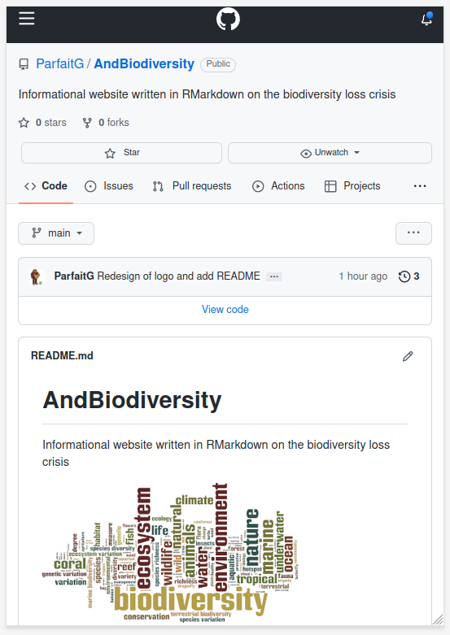
 </a>
</div>


## Sites

<br/>

- #### [**ABC | Environment**](https://abcnews.go.com/alerts/environment){target="_blank"}  
  #### Follow the latest Environment news, videos, and analysis from ABC News.

- #### [**AP | Climate & Environment**](https://apnews.com/hub/climate-and-environment){target="_blank"}  
  #### The latest news from The Associated Press on climate change, threats to biodiversity and renewable energies.

- #### [**BBC | Environment**](https://www.bbc.com/news/topics/cnx753jenyjt){target="_blank"}  
  #### All the latest content about Environment from the BBC.

- #### [**Britannica: Biodiversity Loss**](https://www.britannica.com/explore/savingearth/biodiversity-loss){target="_blank"}  
  #### Encyclopedia article on biodiversity loss.

- #### [**EarthTimes**](https://earthtimes.org/){target="_blank"}  
  #### News and blog articles about the environment and information on current environmental issues and topics affecting planet earth.

- #### [**EcoWatch**](https://www.ecowatch.com/){target="_blank"}  
  #### A digital platform still dedicated to publishing quality, science-based content on environmental issues, causes, and solutions.

- #### [**Environmental News Network**](https://www.enn.com/){target="_blank"}  
  #### Aggregator of environmental news and collection of resources, teachers, experts and tools that provide objective information and knowledge about the increasingly complex field of environmental science.

- #### [**Grist**](https://grist.org/){target="_blank"}  
  #### A nonprofit media organization telling stories of climate solutions and a just future.
  
- #### [**The Guardian | Environment**](https://www.theguardian.com/us/environment){target="_blank"}  
  #### Latest environmental news, opinion and analysis from the Guardian
  
- #### [**Mongabay**](https://news.mongabay.com/){target="_blank"}  
  #### U.S.-based non-profit conservation and environmental science news platform
  
- #### [**National Geographic**](https://www.nationalgeographic.com/environment){target="_blank"}  
  #### Latest stories about the environment

- #### [**NBC News | Environment**](https://www.nbcnews.com/science/environment){target="_blank"}  
  #### Read about the latest headlines covering global warming, recycling, conservation efforts, pollution and more from NBCNews.com

- #### [**NPR | Environment**](https://www.npr.org/sections/environment/){target="_blank"}  
  #### Breaking news on the environment, climate change, pollution, and endangered species from NPR.

- #### [**Overshoot Day**](https://www.overshootday.org/"){target="_blank"}  
  #### Earth Overshoot Day marks the date when humanity has used all the biological resources that Earth regenerates during the entire year.

- #### [**PBS | Environment**](https://www.pbs.org/show/environment/){target="_blank"}  
  #### News and features on our changing environment from PBS.

- #### [**Propublica | Environment**](https://www.propublica.org/topics/environment){target="_blank"}  
  #### Environment news from an independent, non-profit newsroom that produces investigative journalism in the public interest.

- #### [**Reuters | Environment**](https://www.reuters.com/business/environment/){target="_blank"}  
  #### Find latest environment news from every corner of the globe at Reuters.com

- #### [**Science Daily | Environment**](https://www.sciencedaily.com/news/top/environment/){target="_blank"}  
  #### Source for the latest research news
  
- #### [**Stanford University: MAHB**](https://mahb.stanford.edu/){target="_blank"}  
  #### Millennium Alliance for Humanity and the Biosphere (MAHB) is a meeting place for global civil society — citizens concerned with the interconnections among the greatest threats to human well-being: this is the human predicament.
  
- #### [**Yale University: E360**](https://e360.yale.edu/){target="_blank"}  
  #### An original, independent voice in environmental journalism, E360 is an online magazine that publishes opinion, analysis, reporting, and debate on global environmental issues.

<br/>
<br/>
<br/>

## Data

<br/>

### Global

- #### [**Global Biodiversity Information Facility**](https://www.gbif.org/){target="_blank"}  
  #### An international network and data infrastructure funded by the world's governments and aimed at providing anyone, anywhere, open access to data about all types of life on Earth

- #### [**Integrated Biodiversity Assessment Tool**](https://www.ibat-alliance.org/)
  #### The world's most authoritative biodiversity data for your world-shaping decisions

- #### [**IPBES: Modelling impacts of drivers on biodiversity and ecosystems**](https://ipbes.net/modelling-impacts-drivers-biodiversity-ecosystems){target="_blank"}  
  #### Primer on models of biodiversity and ecosystem function with additional resources

- #### [**IPCC: Data Distribution Centre**](https://www.ipcc-data.org/){target="_blank"}  
  #### The DDC provides a transparent, traceable, stable and assessable archive for the climate, socio-economic and environmental data and scenarios used in the reports and key figures produced by the IPCC. 
  
- #### [**IUCN Red List of Threatened Species**](https://www.iucnredlist.org/resources/grid){target="_blank"}  
  #### The most comprehensive information source on the global extinction risk status of animal, fungus and plant species

- #### [**NASA Earth Data: Biological Diversity and Ecological Forecasting**](https://www.earthdata.nasa.gov/learn/biodiversity-data-resources){target="_blank"}  
  #### NASA Earth observation data are a key component of research into the causes behind changes in biodiversity and the impacts of these changes.
  
- #### [**UN Biodiversity Lab**](https://unbiodiversitylab.org/){target="_blank"}  
  #### Provides access to global spatial data to generate insight and impact for conservation and sustainable development
  
- #### [**York University Ecological Footprint Initiative & Global Footprint Network**](https://data.footprintnetwork.org){target="_blank"}  
  #### Data materials and outputs assessing national footprint and biocapacity accounts across the world
  
<br/>

### Regional

- #### [**Atlas of Living Australia**](https://www.ala.org.au/)
  #### Open Access to Australia's biodiversity data

- #### [**NatureServe Explorer**](https://explorer.natureserve.org/){target="_blank"}  
  #### The definitive source for information on rare and endangered species and ecosystems in the Americas.
  
- #### [**NBN Atlas**](https://nbnatlas.org/)
  #### UK's largest collection of biodiversity information

- #### [**NOAA: DIVER**](https://www.diver.orr.noaa.gov/)
  #### The DIVER (Data Integration, Visualization, Exploration, and Reporting) tool was developed by NOAA to support these natural resource damage assessment (NRDA) efforts.
  
- #### [**USA EPA: Ecoregions Maps**](https://www.epa.gov/eco-research/ecoregions){target="_blank"}  
  #### Continental and conterminous US ecoregions maps and GIS datasets for spatial analysis
  
<br/>

### Plants

- #### [**BGCI: ThreatSearch Database**](https://tools.bgci.org/threat_search.php){target="_blank"}  
  #### The most comprehensive database of conservation assessments of plants

- #### [**Kew: Plants of the World Online**](https://powo.science.kew.org/)
  #### An international collaborative programme that has as a primary aim to make available digitized data of the world’s flora gathered from the past 250 years of botanical exploration and research
  
- #### [**World Flora Online**](http://www.worldfloraonline.org/){target="_blank"}  
  #### Global overview of the diversity of plant species
  
<br/>

### Animals

- #### [**BirdLife International: Data Zone**](http://datazone.birdlife.org/home)
  #### Web portal for case studies, Important Bird and Biodiversity Areas (IBAs), country profiles, and case studies regarding bird species.

- #### [**WWF: Living Planet Index**](https://livingplanetindex.org/data_portal){target="_blank"}  
  #### Dataset contains time-series of population abundance data for vertebrate species spanning years between 1970 and 2021.

<br/>

### Fungi

- #### [**GlobalFungi Database**](https://globalfungi.com/)
  #### Validated collection of published data on the composition of soil fungal communities in terrestrial environments including soil and plant-associated habitats and made them publicly accessible through a user interface 

<br/>

### Land

- #### [**WWF Terrestrial Ecoregions Of The World (Biomes) in ArcGIS**](https://www.arcgis.com/apps/View/index.html?appid=d60ec415febb4874ac5e0960a6a2e448){target="_blank"}  
  #### ArcGIS app to explorer the world's 800+ terrestial ecoregions classified in 14 different biome types

<br/>

### Ocean

- #### [**Ocean Biodiversity Information System (OBIS)**](https://obis.org/){target="_blank"}  
  #### Global open-access data and information clearing-house on marine biodiversity for science, conservation and sustainable

<br/>
<br/>

## Research

<div class="logo_container">
<table class="icons">
  <tr>
    <td><a href="https://www.biodiversa.org/" target="blank"></a></td>
    <td><a href="https://briwildlife.org/" target="blank">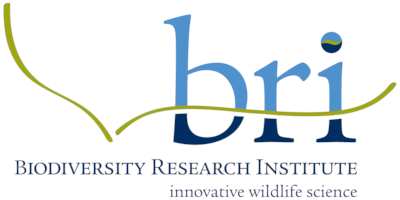</a></td>
    <td><a href="https://www.biodiversitylibrary.org/" target="blank">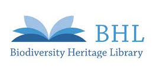</a></td>
    <td><a href="https://www.epa.gov/enviroatlas/enviroatlas-benefit-category-biodiversity-conservation" target="blank">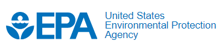</a></td>
  </tr>
  <tr>
    <td><a href="https://fwbg.org/" target="blank">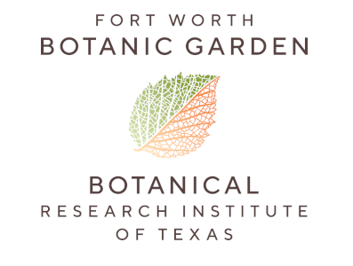</a></td>
    <td><a href="https://www.frontiersin.org/" target="blank">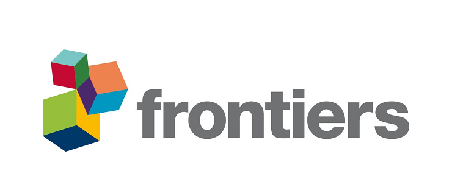</a></td>
    <td><a href="https://www.gbif.org" target="blank">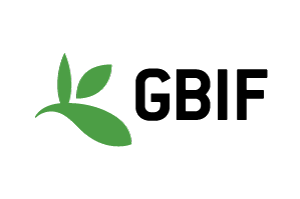</a></td>
    <td><a href="https://www.globalsoilbiodiversity.org/">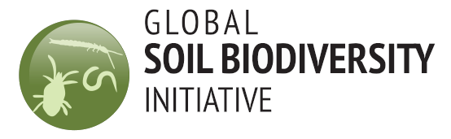</a></td>
  </tr>
  <tr>
    <td><a href="https://cce.nasa.gov/biodiversity/index.html" target="blank">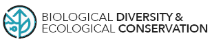</a></td>
    <td><a href="https://www.nature.com/subjects/biodiversity" target="blank">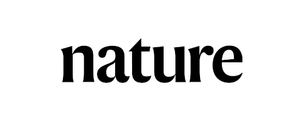</a></td>
    <td><a href="https://www.pnas.org/topic/bio-sci" target="blank">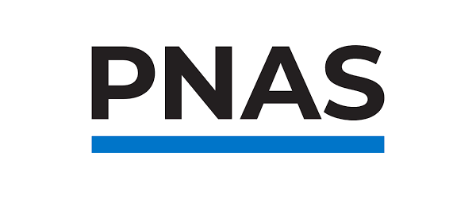</a></td>
    <td><a href="https://www.researchgate.net/" target="blank"></a></td>
  </tr>
  <tr>
    <td><a href="https://www.scientificamerican.com/environment" target="blank"></a></td>
    <td><a href="https://www.stockholmresilience.org/" target="blank">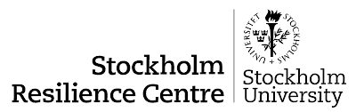</a></td>
    <td><a href="https://biodiversity.ubc.ca/research" target="blank"></a></td>
    <td><a href="https://www.usgs.gov/programs/science-analytics-and-synthesis-sas/biodiversity-science" target="blank"></a></td>
  </tr>
</table>
</div>

<br/>
<br/>
<br/>

## Organizations

<div class="logo_container">
  <table class="icons">
   <tr>
      <td><a href="https://zeroextinction.org" target="blank">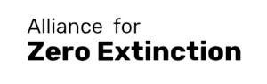</a></td>
      <td><a href="https://www.bgci.org/" target="blank">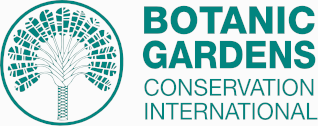</a></td>
      <td><a href="https://www.biologicaldiversity.org/" target="blank"></a></td>
      <td><a href="https://cites.org/eng" target="blank">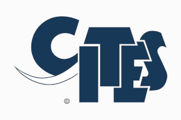</a></td>
      <td><a href="https://www.cbd.int/" target="blank">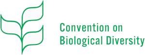</a></td>
   </tr>
   <tr>
      <td><a href="https://www.edf.org/" target="blank">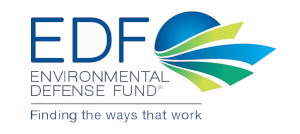</a></td>
      <td><a href="https://www.fauna-flora.org/" target="blank"></a></td>
      <td><a href="https://www.footprintnetwork.org/" target="blank">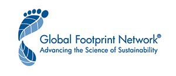</a></td>
      <td><a href="https://www.greenpeace.org/international/" target="blank">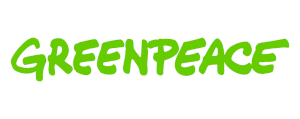</a></td>
      <td><a href="https://ipbes.net/" target="blank"></a></td>
   </tr>
   <tr>
      <td><a href="https://www.ipcc.ch/" target="blank"></a></td>
      <td><a href="https://iucn.org/" target="blank">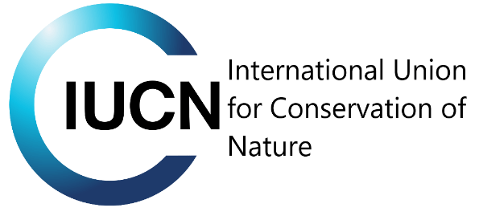</a></td>
      <td><a href="https://www.natureserve.org/" target="blank"></a></td>
      <td><a href="https://www.nature.org/" target="blank">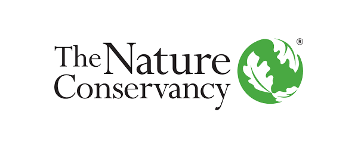</a></td>
      <td><a href="https://www.nrdc.org/" target="blank">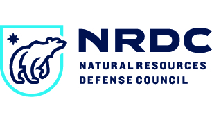</a></td>
   </tr>
   <tr>
      <td><a href="https://oceanconservancy.org/" target="blank">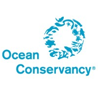</a></td>
      <td><a href="https://www.sierraclub.org/" target="blank">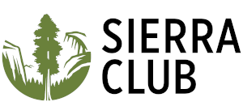</a></td>
      <td><a href="https://www.unccd.int/" target="blank">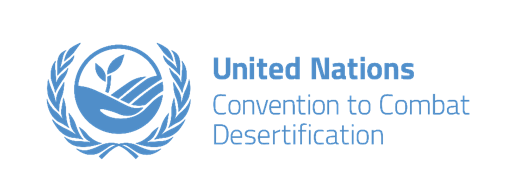</a></td>
      <td><a href="https://whc.unesco.org/" target="blank">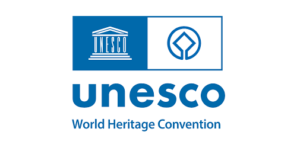</a></td>
      <td><a href="https://www.unep.org/" target="blank">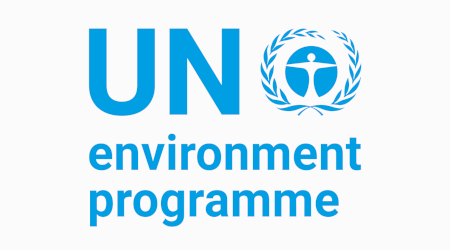</a></td>
   </tr>
   <tr>
      <td><a href="https://www.unep-wcmc.org/en" target="blank"></a></td> 
      <td><a href="" target="blank">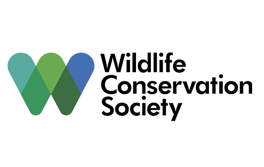</a></td>
      <td><a href="https://wildlife.org/" target="blank">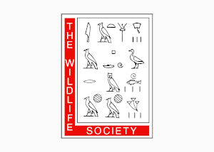</a></td>
      <td><a href="https://www.worldwildlife.org/" target="blank">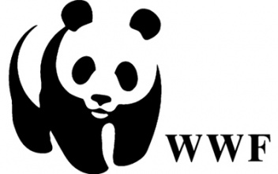</a></td>
      <td><a href="https://www.zsl.org/" target="blank">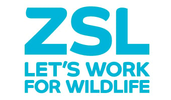</a></td> 
   </tr>
  </table>
</div>

<br/>
<br/>
<br/>

## Documentaries

<div class="logo_container">
  <table class="docs">
   <tr>
      <td><a href="https://www.imdb.com/title/tt0296310" target="blank">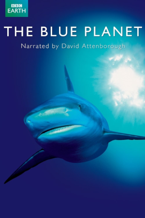</a></td>
      <td><a href="https://www.imdb.com/title/tt14539726" target="blank">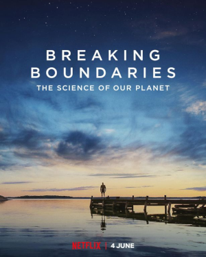</a></td>
      <td><a href="https://www.imdb.com/title/tt6333054/" target="blank">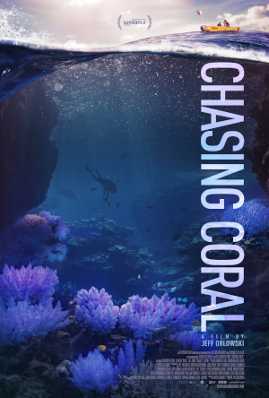</a></td> 
      <td><a href="https://www.imdb.com/title/tt0365109" target="blank">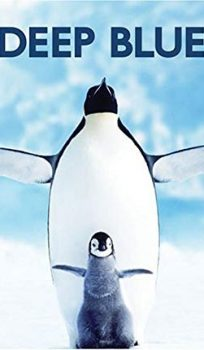</a></td>
      <td><a href="https://www.imdb.com/title/tt13099124" target="blank">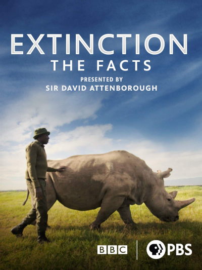</a></td>
   </tr>
   <tr>
      <td><a href="https://www.imdb.com/title/tt16986646" target="blank">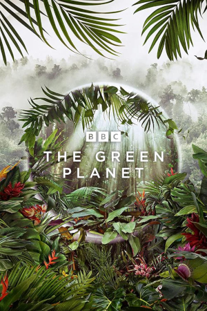</a></td> 
      <td><a href="https://www.imdb.com/title/tt5952266" target="blank">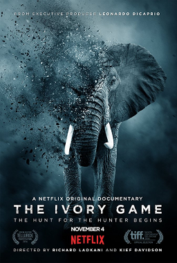</a></td>
      <td><a href="https://www.imdb.com/title/tt11989890" target="blank">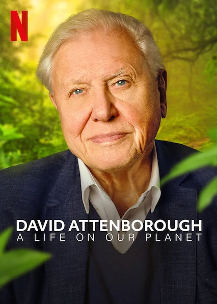</a></td> 
      <td><a href="https://www.imdb.com/title/tt2004304" target="blank">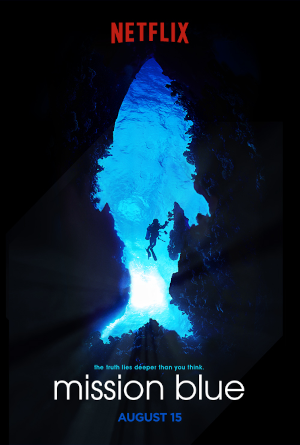</a></td>
      <td><a href="https://www.imdb.com/title/tt9253866" target="blank">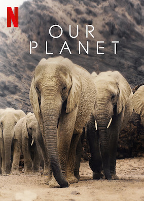</a></td>
   </tr>
   <tr>
      <td><a href="https://www.imdb.com/title/tt0795176" target="blank">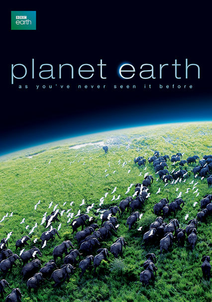</a></td>
      <td><a href="https://www.imdb.com/title/tt14152756" target="blank">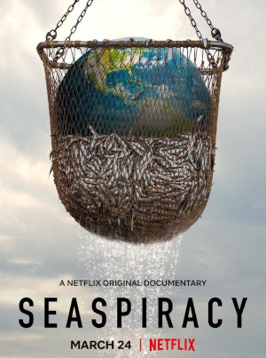</a></td> 
      <td><a href="https://www.imdb.com/title/tt5203824" target="blank">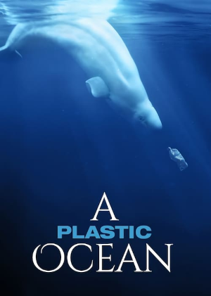</a></td> 
      <td><a href="https://www.imdb.com/title/tt6769208" target="blank">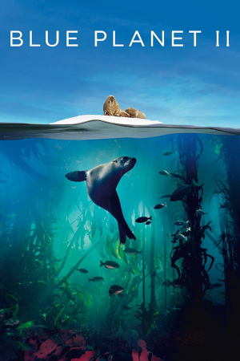</a></td>
      <td><a href="https://www.imdb.com/title/tt5491994" target="blank">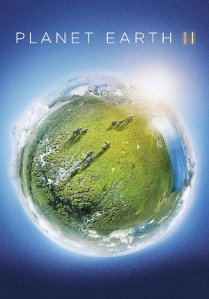</a></td>
   </tr>
  </table>
</div>

<br/>
<br/>
<br/>

## Videos

<br/>


#### IPBES Global Assessment Animation: Direct Drivers of Biodiversity Loss

<div class="framecontainer">
  <iframe src="https://player.vimeo.com/video/334457422" frameborder="0" allow="autoplay; fullscreen" allowfullscreen></iframe>
</div>

<br/>

#### Greenpeace: Biodiversity loss from land use

<div class="framecontainer">
  <iframe src="https://player.vimeo.com/video/385534892" frameborder="0" allow="autoplay; fullscreen" allowfullscreen></iframe>
</div>

<br/>

#### WWF: Untangled: Biodiversity Loss

<div class="framecontainer">
  <iframe src="https://www.youtube.com/embed/KM0EZP5ijbA" title="YouTube video player" frameborder="0" allow="accelerometer; autoplay; clipboard-write; encrypted-media; gyroscope; picture-in-picture" allowfullscreen></iframe>
</div>


<br/>
<br/>
<br/>

---

#

<br/>
<br/>

---

#### Why _And Biodiversity_? To capture synergies:

<br/>

<div class="table_container">
<table id="bottom_icons">
   <tr>
      <td><a title="Reforestation or restoration of degraded forests and woodlands with indigenous species plays a role in addressing losses of biodiversity and ecosystem services, including through recovering the soil carbon stocks of these ecosystems (IPBES-IPCC)" tabindex="0"></a></td>
      <td><h3>Reforestation</h3></td>
      <td><a title="Some recent analysis have discussed the impact of rewilding on ecosystem carbon cycling and hence climate change mitigation, given the effects animals and trophic cascades have on biomass consumption, carbon turnover, or methane emissions (IPBES-IPCC)" tabindex="0"></a></td>
      <td><h3>Rewilding</h3></td>
      <td><a title="Fisheries management currently does not take into account the potential role of exploited species in the carbon cycle and in biogeochemical processes, nor does it consider the potential for carbon release from sediment disturbance (IPBES-IPCC)" tabindex="0"></td>
      <td><h3>Sustainable<br/>Fishing</h3></a></td>
      <td><a title="While cities have generally low levels of biodiversity, many efforts are undertaken to green cities with multiple co-benefits for human well-being, with the potential to connect to surrounding natural or managed areas, and contribute to both biodiversity conservation and climate change mitigation regionally, as is the case in coastal cities for example (IPBES-IPCC)" tabindex="0"></a></td>
      <td><h3>Spatial<br/>Planning</h3></td>
      <td><a title="Eliminating subsidies that support local and national activities harmful to biodiversity can also add up to support climate change mitigation, e.g., halting deforestation, overfertilization or overfishing (IPBES-IPCC)" tabindex="0"></a></td>
      <td><h3>Eliminate<br/>Subsidies</h3></td>
   </tr>
   <tr>
      <td><a title="Actions like reducing pollution, making sure that exploitation is at levels that allow for resistance and resilience and managing invasive alien species can make substantial contributions to adaptive capacity of species and ecosystems (IPBES-IPCC)" tabindex="0"></a></td>
      <td><h3>Reduce Invasive<br/>Alien Species</h3></td>
      <td><a title="The situation in the high-seas and areas beyond national jurisdiction (ABNJ) require Regional fisheries management organizations (RFMO) to promote solutions to ocean pollution that amplifies climate change impacts as part of the Ecosystem Approach to Fisheries implementation. (IPBES-IPCC)" tabindex="0"></a></td>
      <td><h3>Reduced<br/>Pollution</h3></td>
      <td><a title="Because biodiversity conservation in protected areas alone is insufficient to successfully safeguard biodiversity (and as shown earlier to contribute to climate change mitigation), biodiversity mainstreaming (i.e., making it a consideration in all sectors, rather than just in its own domain) is now accorded high priority in the CBD. (IPBES-IPCC)" tabindex="0"></a></td> 
      <td><h3><i><strong>Mainstreaming<br/>Biodiversity</strong></i></h3></td>
      <td><a title="Ecosystem restoration provides opportunities for co-benefits for climate change mitigation and biodiversity conservation, which are maximized if restoration occurs in priority areas for both goals (IPBES-IPCC)." tabindex="0"></a></td>
      <td><h3>Ecosystem<br/>Restoration<br/></h3></td>
      <td><a title="The contribution of conventional agriculture to biodiversity loss can be addressed through alternative agricultural systems, including sustainable intensification and complete redesign of farm management systems (e.g., ecological intensification and climate-smart agriculture) (IPBES-IPCC)" tabindex="0"></a></td>
      <td><h3>Regenerative<br/>Agriculture</h3></td>
   </tr>
</table>
</div>


<br/>

::: {.footer}
<div class="footer_box">
  <div class="footer_label">
  <a href="index.html"></a>
  <a href="index.html"> | And Biodiversity</a>
  </div>
  <div class="footer_space"><br/><br/></div>
  <div class="footer_column">
The highest good is like water.<br/>
Water gives life to the ten thousand things and does not strive.<br/>
It flows in places men reject and so is like the Tao.<br/>
  </div>
  <div class="footer_column">
In dwelling, be close to the land.<br/>
In meditation, go deep in the heart.<br/>
In dealing with others, be gentle and kind...
  </div>
  <div class="footer_space">
-"Eight"<br/>
Lao Tsu<br/>
<i>Tao Te Ching</i><br/>
  </div>
</div>
:::
